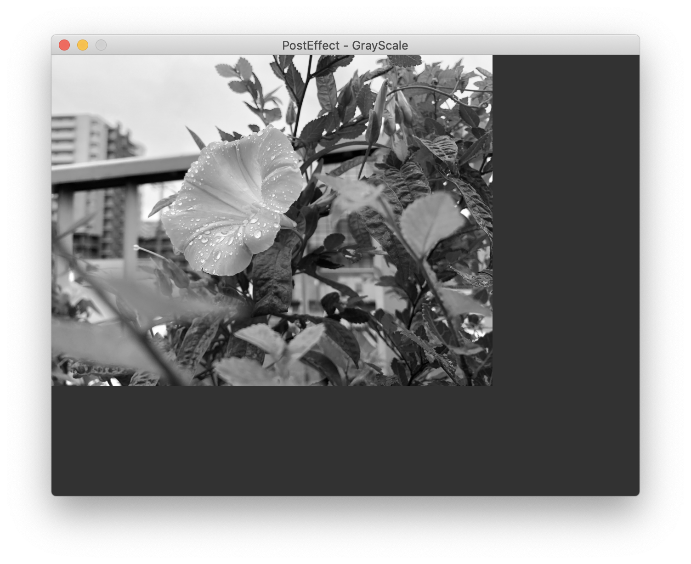
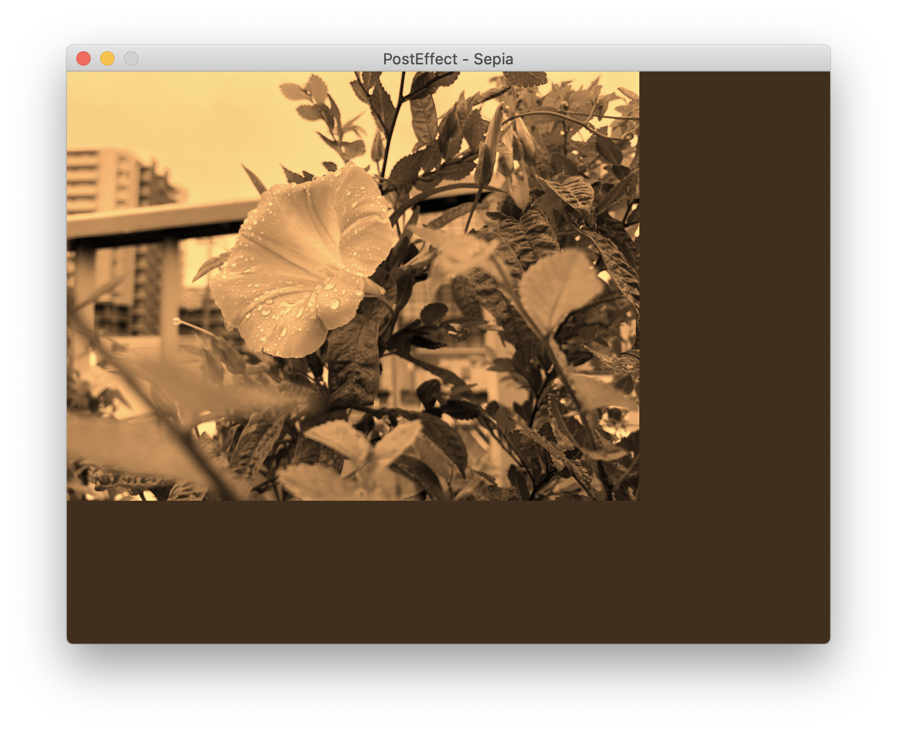
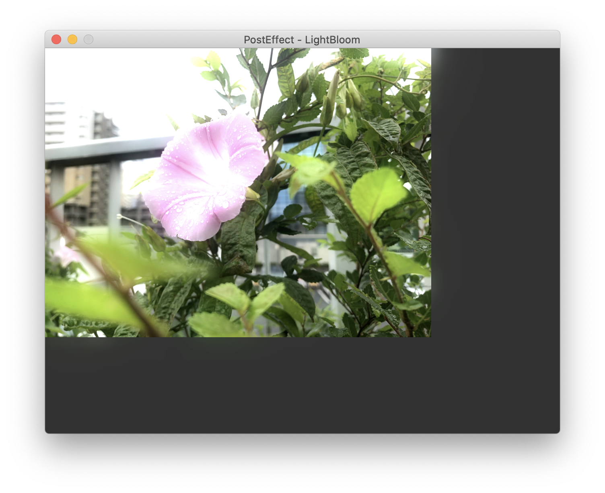
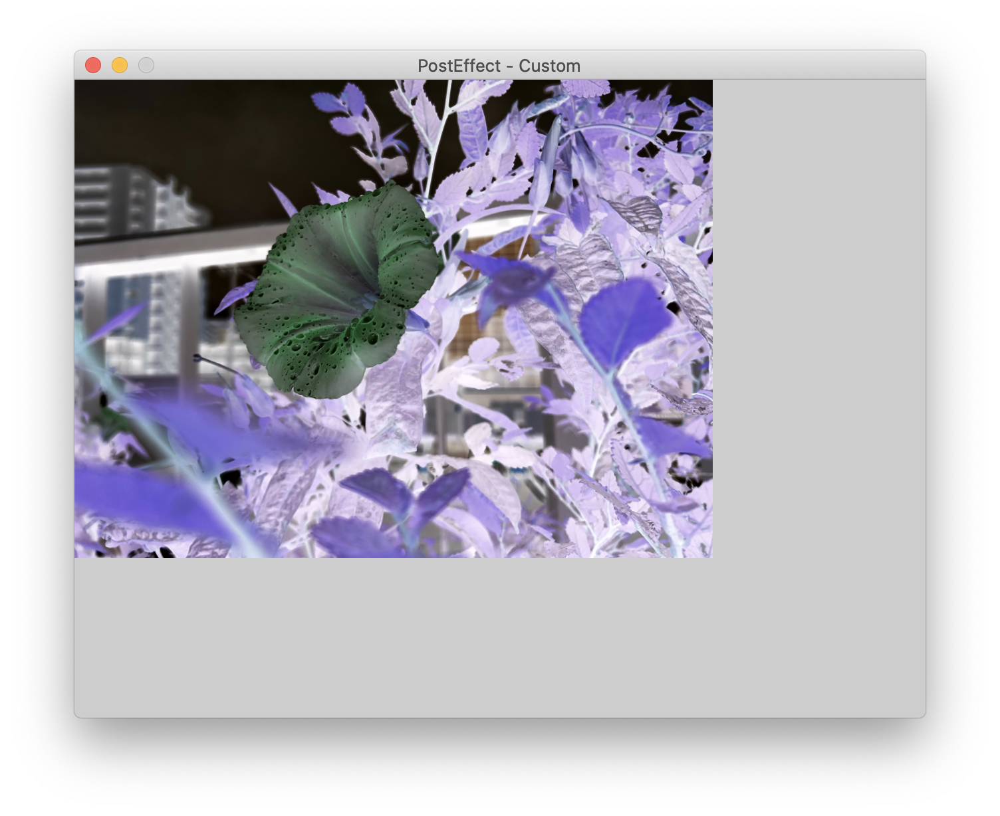

# ポストエフェクト

[PostEffectNode](xref:Altseed2.PostEffectNode)は画面やカメラに対し何らかの効果を加えて表示される映像を変化させるノードです。[DrawnNode](xref:Altseed2.DrawnNode)が描画された後にポストエフェクトの描画が行われます。

## 組み込みポストエフェクト

### グレースケール

[PostEffectGrayScaleNode](xref:Altseed2.PostEffectGrayScaleNode)は画面をグレースケール化するポストエフェクトです。

[!code-csharp[Main](../../Src/Samples/Graphics/PostEffectGrayScale.cs)]

### セピアカラー

[PostEffectSepiaNode](xref:Altseed2.PostEffectSepiaNode)は画面をセピア調にするポストエフェクトです。

[!code-csharp[Main](../../Src/Samples/Graphics/PostEffectSepia.cs)]

### ガウスぼかし

[PostEffectGaussianBlurNode](xref:Altseed2.PostEffectGaussianBlurNode)は画面にぼかしを書けるポストエフェクトです。画面が一様にぼけます。

[!code-csharp[Main](../../Src/Samples/Graphics/PostEffectGaussianBlur.cs)]

### ライトブルーム

[PostEffectLightBloomNode](xref:Altseed2.PostEffectLightBloomNode)は画面で一定以上明るい画素をぼかして加算することで、光が溢れているような表現を与えるポストエフェクトです。

具体的な処理としては元の画像から閾値を超えた画素を抽出し、閾値を超えた分の輝度をぼかして元の画像に加算しています。

[!code-csharp[Main](../../Src/Samples/Graphics/PostEffectLightBloom.cs)]

## 自作ポストエフェクト

[PostEffectNode](xref:Altseed2.PostEffectNode), [Shader](xref:Altseed2.Shader), [Material](xref:Altseed2.Material)のクラスを使用して、自作ポストエフェクトを実装できます。下記のサンプルでは、階調を反転させています。

HLSLのコードを記述すれば、Altseedが内部で適切に変換するため、自動的にマルチプラットフォーム対応になります。

[!code-csharp[Main](../../Src/Samples/Graphics/CustomPostEffect.cs)]
