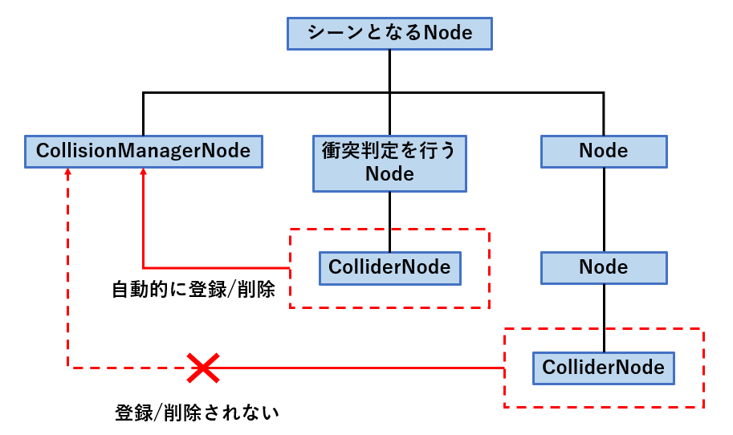

# 衝突判定

Altseed2では物理演算を用いて，2Dの衝突判定を行う機構が備わっています。  

## [Collider](xref:Altseed.Collider)クラス

[Collider](xref:Altseed.Collider)クラスは自身のメンバの情報をもとに他[Collider](xref:Altseed.Collider)のインスタンスとの衝突の有無を判定します。  
[Collider](xref:Altseed.Collider)と衝突判定の種類は以下の通りです。

| [Collider](xref:Altseed.Collider) | 衝突判定のタイプ | 使用するメンバ |
| :---: | :---: | :---: |
| [CircleCollider](xref:Altseed.CircleCollider) | 円形 | [中心](xref:Altseed.Collider.Position)，[半径](xref:Altseed.CircleCollider.Radius) |
| [PolygonCollider](xref:Altseed.PolygonCollider) | 多角形 | [各頂点の座標](xref:Altseed.PolygonCollider.Vertexes) |
| [RectangleCollider](xref:Altseed.RectangleCollider) | 短形 | [左上の座標](xref:Altseed.Collider.Position)，[中心座標](xref:Altseed.RectangleCollider.CenterPosition)，[サイズ(縦・横)](xref:Altseed.RectangleCollider.Size) |

[Collider](xref:Altseed.Collider)との衝突判定は[GetIsCollidedWith(Collider)](xref:Altseed.Collider.GetIsCollidedWith(Altseed.Collider))メソッドを使用します。  
指定したコライダと衝突していたらtrue，衝突していなかったらfalseを返します。  

## [ColliderNode](xref:Altseed.ColliderNode)クラスと[CollisionManagerNode](xref:Altseed.CollisionManagerNode)クラス

この2つのクラスによって，コライダの衝突判定を自動で行う事が出来ます。  

### [ColliderNode](xref:Altseed.ColliderNode)クラス

このクラスは[Collider](xref:Altseed.Collider)クラスを内部に持っています。  
また，この派生クラスに[CircleColliderNode](xref:Altseed.CircleColliderNode)，[PolygonColliderNode](xref:Altseed.PolygonColliderNode)，
[RectangleColliderNode](xref:Altseed.RectangleColliderNode)クラスがあり，それぞれ[CircleCollider](xref:Altseed.CircleCollider)，
[PolygonCollider](xref:Altseed.PolygonCollider)，
[RectangleCollider](xref:Altseed.RectangleCollider)クラスのインスタンスを内部に持っています。  
これらのクラスのプロパティを通して，内部コライダのメンバの操作を行う事が出来ます。  

> [!IMPORTANT]
> このクラスは，衝突判定を行いたいノード(シューティングゲームで言う自機や弾となるノード)の**子ノードとして**使用される必要があります。

### [CollisionManagerNode](xref:Altseed.CollisionManagerNode)クラス

このクラスでは[ColliderNode](xref:Altseed.ColliderNode)クラスのインスタンスが自動的に登録され，[GetIsCollidedWith(Collider)](xref:Altseed.Collider.GetIsCollidedWith(Altseed.Collider))メソッドを自動的に実行します。

> [!TIP]
> [GetIsCollidedWith(Collider)](xref:Altseed.Collider.GetIsCollidedWith(Altseed.Collider))メソッドによる衝突判定は，同じ[ColliderNode](xref:Altseed.ColliderNode)の組み合わせに対して1フレームにつき1度しか行われません。

> [!IMPORTANT]
> このクラスは衝突判定を行いたいノードの**親ノードの子として**使用される必要があります。  
> また，1つのノードに対して，[CollisionManagerNode](xref:Altseed.CollisionManagerNode)クラスのインスタンスは1つしか子として持つ事が出来ません。(登録しようとした場合は例外がスローされます。)

### 実装の形式

[ColliderNode](xref:Altseed.ColliderNode)クラスと[CollisionManagerNode](xref:Altseed.CollisionManagerNode)クラスはそれぞれ以下の図のような関係でなければなりません。  

> [!IMPORTANT]
> [ColliderNode](xref:Altseed.ColliderNode)の自動登録には，シーンとなるノードに対して，**[CollisionManagerNode](xref:Altseed.CollisionManagerNode)が子ノードであり，かつ[ColliderNode](xref:Altseed.ColliderNode)が孫ノードである**事が重要です。  
> それ以外の場合における[ColliderNode](xref:Altseed.ColliderNode)の自動的な追加/削除は発生しません。

> [!IMPORTANT]
> 衝突判定を行うノードが[ICollisionEventReceiver](xref:Altseed.ICollisionEventReceiver)インターフェイスを実装している場合，
> 
> - 衝突の開始
> - 衝突の継続
> - 衝突の終了
> 
> においてそれぞれ対応したメソッドが呼び出されます。

以上の点を踏まえた実装は以下のサンプルコードの通りです。  

[!code-csharp[Main](../../Src/Samples/Physics/Collision.cs)]

#### 結果
衝突を開始したときに`Collision started.`と出力され，以降衝突している間ずっと`Collision is keeped.`と出力されます。  
衝突終了時には`Collision finished.`と出力されます。