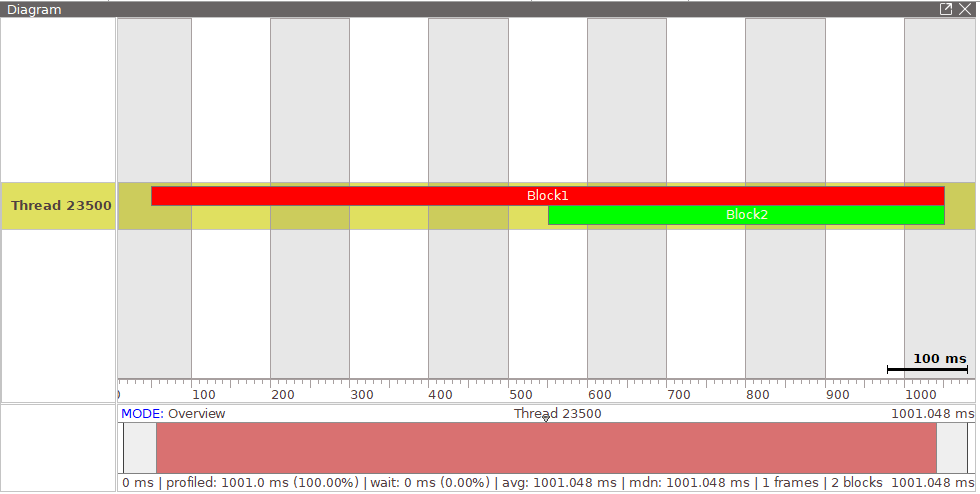

# プロファイラ

[Profiler](xref:Altseed2.Profiler)クラスは、処理時間を測定する機能です。
指定した範囲の処理が実行された時間及びタイミングを取得します。

この機能は[easy_profiler](https://github.com/yse/easy_profiler)を使用します。

以下のように記述して情報を出力します。

```csharp
Engine.Profiler.StartCapture();
{
    using var block1 = new ProfilerBlock("Block1", new Color(255, 0, 0));
    System.Threading.Thread.Sleep(500);
    {
        using var block2 = new ProfilerBlock("Block2", new Color(0, 255, 0));
        System.Threading.Thread.Sleep(500);
    }
}
Engine.Profiler.DumpToFileAndStopCapture("Profiler.prof");
```

それをeasy_profilerのReleaseからエディタをダウンロードし、出力されたファイルを読み込みます。



ファイルに出力しなくとも、リモートからネットワーク経由で情報を取得することもできます。
以下のコードでネットワークを有効にし、easy_profilerのエディタから接続します。

```csharp
Engine.Profiler.StartListen(28077);
```
