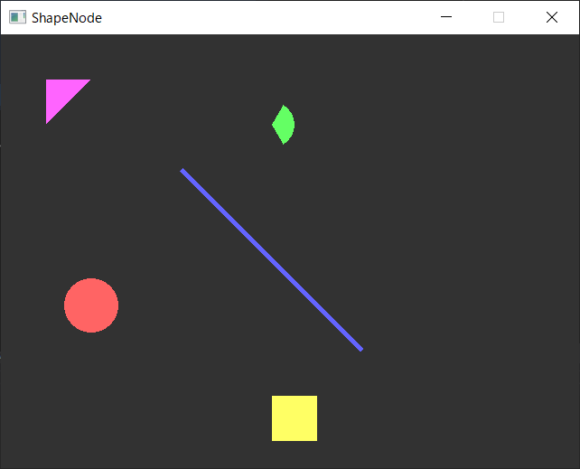

# 図形ノード

Altseed2には図形を描画するノードが存在します。
描画できる図形は円弧，円，直線，短形，三角形があります。

## 円の描画

円の描画は[`CircleNode`](xref:Altseed2.CircleNode)で行う事が出来ます。

設定できる情報と対応するプロパティは以下の通りです。

|設定できる情報|対応するプロパティ|備考|
|:---:|:---:|:---|
|中心座標|Position||
|半径|Radius||
|頂点の数|VertNum|3以上にしなければならない。|

`VertNum`を調整する事で，三角形や五角形など正多角形を描画出来ます。
円にしたければ頂点の数を増やすと良いでしょう。

## 円弧の描画

円弧の描画は[`ArcNode`](xref:Altseed2.ArcNode)で行う事が出来ます。
`ArcNode`では`CircleNode`の内容に加えて，描画をする角度の範囲を設定できます。

設定できる情報と対応するプロパティは以下の通りです。

|設定できる情報|対応するプロパティ|備考|
|:---:|:---:|:---|
|中心座標|Position||
|半径|Radius||
|頂点の数|VertNum|3以上にしなければならない。|
|描画開始角度|StartDegree||
|描画終了角度|EndDegree||

> [!NOTE]
> `StartDegree`と`EndDegree`の値はそれぞれ-360～360の間に自動的に修正されます，
> その差も360までに自動的に修正されます。  
> `StartDegree`と`EndDegree`の大小に指定はありません。

## 直線の描画

直線の描画は[`LineNode`](xref:Altseed2.LineNode)で行う事が出来ます。

設定できる情報と対応するプロパティは以下の通りです。

|設定できる情報|対応するプロパティ|
|:---:|:---:|
|端点1|Point1|
|端点2|Point2|
|太さ|Thickness|

## 短形の描画

短形の描画は[`RectangleNode`](xref:Altseed2.RectangleNode)で行う事が出来ます。

設定できる情報と対応するプロパティは以下の通りです。

|設定できる情報|対応するプロパティ|備考|
|:---:|:---:|:---|
|左上頂点の座標|Position||
|サイズ|Size|Texture.Sizeに関係なくこのプロパティの値で決定。|

## 三角形の描画

三角形の描画は[`TriangleNode`](xref:Altseed2.TriangleNode)で行う事が出来ます。

設定できる情報と対応するプロパティは以下の通りです。

|設定できる情報|対応するプロパティ|
|:---:|:---:|
|頂点1|Point1|
|頂点2|Point2|
|頂点3|Point3|

## サンプルコード

サンプルコードは以下の通りです。

[!code-cs[Sample](../../Src/Samples/ShapeNode/ShapeNode.cs)]

これを実行するとこのように図形が描画されます。

