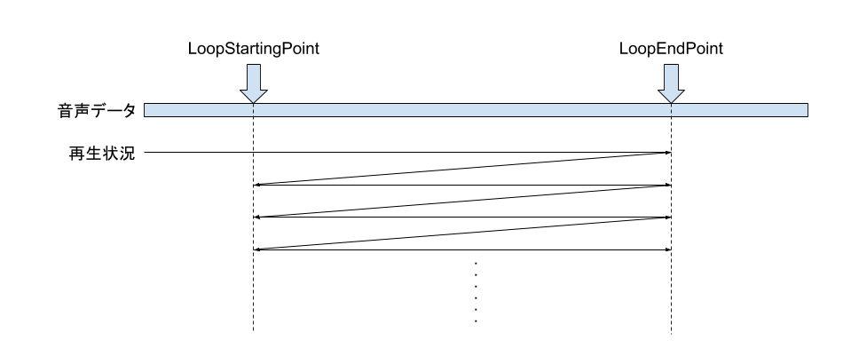
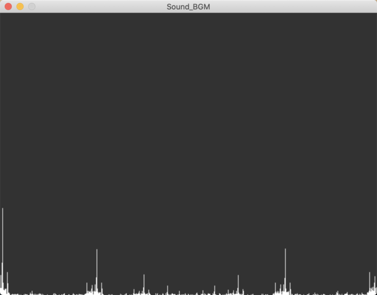

# サウンド

サウンドを再生するには、[Load](xref:Altseed.Sound.Load(System.String,System.Boolean))メソッドを用いてサウンドファイルを読み込み[Sound](xref:Altseed.Sound)インスタンスを作成します。次に[Engine.Sound.Play](xref:Altseed.SoundMixer.Play(Altseed.Sound))メソッドを用いて[Sound](xref:Altseed.Sound)インスタンスを再生します。  

このとき返される ID や、ID を用いて再生中のサウンドを操作する機能について解説します。

## [Sound](xref:Altseed.Sound)

[Sound](xref:Altseed.Sound)はサウンドファイルを読み込んで生成される音源の情報を表すデータです。
サウンドファイルを読み込んで[Sound](xref:Altseed.Sound)インスタンスを生成するには[Load](xref:Altseed.Sound.Load(System.String,System.Boolean))メソッドを使います。  

この時、事前に音のデータを解凍するかどうかを指定できます。
OGG等のフォーマットでは、音のデータが圧縮された状態で格納されているため、音を再生前にデータを解凍しなければなりません。
読み込み時に音のデータを解凍しなかった場合、再生しながらリアルタイムに解凍することになります。

> [!IMPORTANT]
> 音のデータをを事前に解凍するか、再生中にリアルタイムに解凍するかによって、消費するメモリやCPUへの負荷が異なります。
> 事前に解凍する場合、読み込み時間は長くなりメモリも消費しますが再生時のCPUへの負荷は小さくなります。
> 一方、再生中にリアルタイムに解凍する場合は、読み込み時間もメモリも小さくなりますが、再生時に若干CPUの処理を必要とします。
> 基本的に、音が長い **BGMは圧縮したまま** 、音が短くたくさん鳴らす **効果音は事前に解凍** して読み込みます。

サウンドはループさせることが可能です。サウンドをループさせるには[IsLoopingMode](xref:Altseed.Sound.IsLoopingMode)を`true`にします。
ループする範囲は[LoopStartingPoint](xref:Altseed.Sound.LoopStartingPoint)や[LoopEndPoint](xref:Altseed.Sound.LoopEndPoint)を設定することでを設定でき、
ループする範囲を設定していない場合、音を最後まで再生したら最初に戻ってループします。
[LoopStartingPoint](xref:Altseed.Sound.LoopStartingPoint)や[LoopEndPoint](xref:Altseed.Sound.LoopEndPoint)を設定すると、先頭から音を再生し、
[LoopEndPoint](xref:Altseed.Sound.LoopEndPoint)に到達したら[LoopStartingPoint](xref:Altseed.Sound.LoopStartingPoint)の位置に戻ることを繰り返します。

## [SoundMixer](xref:Altseed.SoundMixer)

音の再生・停止・その他操作を行う機能を提供します。音を再生する際に使用します。

音を再生するには[Play](xref:Altseed.SoundMixer.Play(Altseed.Sound))メソッドを使用します。このメソッドを実行すると、再生される音に対応するIDが返されます。
[SoundMixer](xref:Altseed.SoundMixer)クラスの各メソッドに、このIDを渡すことで再生されている音に対して操作をすることができます。  

[SoundMixer](xref:Altseed.SoundMixer)クラスで行える操作は次の通りです。

- 音の停止・一時停止・再開
- 音量の変更・フェードイン/アウト
- 再生速度・パン位置・再生位置の取得・変更
- スペクトル情報の取得

> [!TIP]
> Altseedでは、再生されている音に対する操作をIDを通して行っています。これは、音のデータそのものとは別に、音の再生情報に関するデータを管理するためです。  
> 音のデータが再生情報を含んでいる場合、同じ音を二重に再生することができません。

> [!TIP]
> BGMなどを除き、再生中に停止などの操作を行うことは稀です。そのため再生の度に、再生情報を含むインスタンスを生成することは無駄が大きいため、都度IDを用いて操作する仕組みになっています。

### スペクトル情報の取得

[SoundMixer](xref:Altseed.SoundMixer)クラスにはメディアアートのための機能として、スペクトルアナライザが実装されています。[GetSpectrumData](xref:Altseed.SoundMixer.GetSpectrum(System.Int32,System.Int32,Altseed.FFTWindow))メソッドを使用することで、再生中の音声のスペクトル情報を取得し、それを使って独自のサウンドビジュアライザを作ることができます。

> [!TIP]
> 音は波としての性質を持ちます。スペクトルアナライザでは、その波のデータに対して、どの周波数の成分の波形がどれくらいの量含まれているかを解析します。解析する手法としてフーリエ変換が用いられています。

## サンプル

### 効果音の再生

[!code-csharp[Main](../../Src/Samples/Sound/SE.cs)]

### BGMの再生

[!code-csharp[Main](../../Src/Samples/Sound/BGM.cs)]

### BGMのループ再生

[!code-csharp[Main](../../Src/Samples/Sound/LoopingBGM.cs)]

### スペクトル情報の取得

[!code-csharp[Main](../../Src/Samples/Sound/Spectrum.cs)]