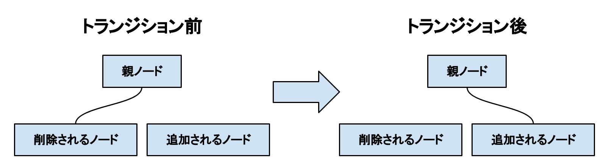

# トランジション

トランジションとは、画面効果を演出しながら時間をかけて画面を切り替える機能を指します。
トランジションは、例えばフェードアウト・フェードインといった画面効果を与えます。
[TransitionNode](xref:Altseed2.TransitionNode)を使用することで、トランジションを導入することができます。

## [TransitionNode](xref:Altseed2.TransitionNode)

トランジションを担当するノードです。
このノードは、トランジション効果を演出するとともに、指定されたノードの入れ替えを行います。

コンストラクタの引数には、削除するノードと新しく追加するノード、そしてノードが入れ替わる前後の期間を指定します。
[TransitionNode](xref:Altseed2.TransitionNode)がエンジンに追加されると、**自動的にトランジションが開始されます。**
また、トランジションが終了すると、**自動的にエンジンから削除されます。**

ノードの入れ替えでは、下図のように、削除されたノードの親に新しくノードを追加するような形で行われます。

[TransitionNode](xref:Altseed2.TransitionNode)を継承する事で、独自のトランジションを作成する事ができます。
継承したクラスでは、以下の処理をオーバーライドできます。

- トランジションが開始した瞬間の処理([OnTransitionBegin](xref:Altseed2.TransitionNode.OnTransitionBegin)メソッド)
- ノードが入れ替わるまでに継続して行われる処理([OnClosing](xref:Altseed2.TransitionNode.OnClosing(System.Single))メソッド)
- ノードが入れ替わる瞬間の処理([OnNodeSwapped](xref:Altseed2.TransitionNode.OnNodeSwapped)メソッド)
- トランジションが終了するまでに継続して行われる処理([OnOpening](xref:Altseed2.TransitionNode.OnOpening(System.Single))メソッド)
- トランジションが終了した瞬間の処理([OnTransitionEnd](xref:Altseed2.TransitionNode.OnTransitionEnd)メソッド)

なお、ノードの入れ替えは[TransitionNode](xref:Altseed2.TransitionNode)が自動で行う為、これらのメソッドの中にノードを入れ替える処理を記述する必要はありません。

> [!IMPORTANT]
> [TransitionNode](xref:Altseed2.TransitionNode)をエンジンに追加しても、すぐにノードが入れ替わるわけではありません。
> トランジションが実行されている間にノードの入れ替えをすると、予期せぬ挙動が発生する可能性があります。

> [!IMPORTANT]
> [TransitionNode](xref:Altseed2.TransitionNode)を、削除予定のノードの子孫ノードにしないでください。
> ノードは入れ替わりますが、その瞬間トランジションの演出が停止します。

## [RuledTransitionNode](xref:Altseed2.RuledTransitionNode)

画面遷移演出を自作する手間を省きたい場合は、こちらを使用します。
このノードは、ルール画像を用いたトランジション機能を提供します。
ルール画像とは、その名の通りトランジションのルールを規定するものです。
一般的には白黒の画像であり、適用すると白い部分から先に画面が切り替わります。

コンストラクタの引数には、[RuledTransitionState](xref:Altseed2.RuledTransitionState)クラスのインスタンスを2つ、そして任意で上から被せるテクスチャを指定します。
上から被せるテクスチャを指定しなかった場合、代わりにノードが追加されたときのの描画情報が、テクスチャとして渡されます。

[RuledTransitionNode](xref:Altseed2.RuledTransitionNode)がエンジンに追加されると、まず画面が指定されたテクスチャの画像に置き換わります。
完全に置き換わった瞬間、指定されたノードが入れ替わります。
その後、テクスチャの画像が少しずつ消えていき、最後にノードが入れ替わった後の新しい描画情報が画面に表示されます。

## [RuledTransitionState](xref:Altseed2.RuledTransitionState)

[RuledTransitionNode](xref:Altseed2.RuledTransitionNode)のコンストラクタの引数に指定するインスタンスのクラスです。
[RuledTransitionState](xref:Altseed2.RuledTransitionState)クラスは、以下をプロパティに持ちます。

- [TargetNode](xref:Altseed2.RuledTransitionState.TargetNode) : 操作を加えるノードを表します。
1つ目の引数にするときは**削除するノード**を、2つ目の引数にするときは**新しく追加するノード**を指定してください。
- [Duration](xref:Altseed2.RuledTransitionState.Duration) : ノードが入れ替わる前後の期間を表します。
1つ目の引数にするときは**ノードが入れ替わるまでの期間**を、2つ目の引数にするときは**ノードが入れ替わった後の期間**を指定してください。
- [RuleTexture](xref:Altseed2.RuledTransitionState.RuleTexture) : トランジションに使用するルール画像を指定します。
- [Softness](xref:Altseed2.RuledTransitionState.Softness) : 画面の変化がどれだけ柔らかくなるかを指定します。
この値が0に近ければ近いほど、画面がシャープに切り替わります。

