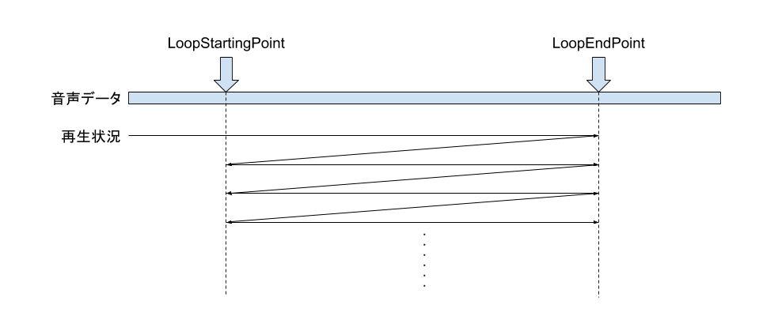

# 音の再生

## [`Sound`](xref:Altseed.Sound) クラス
音ファイルから生成された音の情報を定義します。[`Sound`](xref:Altseed.Sound)クラスは音の情報を格納しているだけであり、実際に音声を再生するにはこれを[`SoundMixer`](xref:Altseed.SoundMixer)に渡す必要があります。

音ファイルから[`Sound`](xref:Altseed.Sound)クラスのインスタンスを生成するには`Load`メソッドを使います。インスタンスを生成するに際し、事前に音データを解凍するかどうかを指定できます。OGG等のフォーマットでは、音データが圧縮された状態で格納されており、音を再生するときは圧縮されたデータを解凍しなければなりません。ここでは、事前にファイルを解凍するか再生中にリアルタイムに解凍するかを指定できます。

このクラスでは音のループポイントを設定できます。音をループさせるには`IsLoopingMode`を`true`にします。ループポイントを設定していない場合、音を最後まで再生したら最初に戻ってループします。`LoopStartingPoint`及び`LoopEndPoint`を設定すると、先頭から音を再生し、`LoopEndPoint`に到達したら`LoopStartPoint`の位置に戻って再開します。

> [!IMPORTANT]
> 音のデータをを事前に解凍するか、再生中にリアルタイムに解凍するかによって、消費するメモリやCPUへの負荷が異なります。
> 事前に解凍する場合、読み込み時間は長くなりメモリも消費しますが再生時のCPUへの負荷は小さくなります。
> 一方、再生中にリアルタイムに解凍する場合は、読み込み時間もメモリも小さくなりますが、再生時に若干CPUの処理を必要とします。
> 基本的に、音が長いBGMは圧縮したまま、音が短くたくさん鳴らす効果音は事前に解凍して読み込みます。

## [`SoundMixer`](xref:Altseed.SoundMixer) クラス
音の再生・停止・その他操作を行う機能を提供します。音を再生する場合は必ず使用する必要があります。

音を再生するには`Play`メソッドを使用します。このメソッドを実行すると、再生される音に対応するIDが発行されます。[`SoundMixer`](xref:Altseed.SoundMixer)クラスの各メソッドにこのIDを渡すと、再生されている音に対して操作をすることができます。[`SoundMixer`](xref:Altseed.SoundMixer)クラスで行える操作は次の通りです。
- 音の停止・一時停止・再開
- 音量の変更・フェードイン/アウト
- 再生速度・パン位置・再生位置の取得・変更
- スペクトル情報の取得

> [!TIP]
> Altseedでは、再生されている音に対する操作をIDを通して行っています。これは、音のデータそのものとは別に、音の再生情報に関するデータを管理するためです。
> 音のデータが再生情報を含んでいる場合、同じ音を二重に再生することができません。
> BGMなどを除き、再生中に停止などの操作を行うことは稀です。そのため再生の度に、再生情報を含むインスタンスを生成することは無駄が大きいため、都度IDを用いて操作する仕組みになっています。

## [`Sound`](xref:Altseed.Sound) クラス ・ [`SoundMixer`](xref:Altseed.SoundMixer) クラスのサンプル

### 効果音の再生
[!code-csharp[Main](SE.cs)]

### BGMの再生
[!code-csharp[Main](BGM.cs)]

### BGMのループ再生
[!code-csharp[Main](LoopingBGM.cs)]