# 0章 : Altseed2 を初めよう

## このチュートリアルは何?
このチュートリアルでは、ゲームエンジン「Altseed2」を使ってシューティングゲームを開発していきます。
プログラミングをやったことがない人でも、このチュートリアルを通してある程度のクオリティのシューティングゲームを作れるようになります。  

このチュートリアルでは、開発に使用するプログラミング言語として C# を用います。
C# の文法自体は本文中でも軽く説明しますが、ある程度 C# の知識を身につけておくと読みやすくなるでしょう。
C# のより詳しい解説は、[C# によるプログラミング入門](https://ufcpp.net/study/csharp/)にわかりやすく纏まっています。
C# の文法や機能について不明な点があった場合は、是非一読してみてください。
また、C# の学習を円滑なものにするため、各章の冒頭に新しく使用する C# の機能とその解説へのリンクを記載しています。
C# の機能をもっと知りたい、本文を読んでもよく分からなかったという場合は、そちらをご参照ください。  

なお、このチュートリアルは、Windows ユーザ及び Mac ユーザを想定しています。

## この章の目標(チュートリアルを始める前に)
この章の目標は、C# と Altseed2 を使って開発を進める前に、必要なツールを導入しておくことです。
ゲームに限らず、どんなアプリケーションを開発するにしても、そのための環境が必要になります。
ここでいう環境とは、アプリケーションを開発するために必要なツールやシステムの組み合わせのことを指します。
すなわち、ゲームを開発する準備段階として、開発に必要なツールを揃えておかなければなりません。
それでは早速必要なツールを導入してみましょう。

## Visual Studio のインストール
Windows や Mac で C# を使用してアプリケーションを開発するには、Visual Studio というツールが必要になります。
Visual Studio は、プログラムのソースコードから実行可能なアプリケーションを生成するツールです。
Visual Studio のインストーラは [Visual Studio のウェブページ](https://visualstudio.microsoft.com/ja/downloads/)からダウンロードすることができます。

### Windows の場合
まず「Visual Studio 2019」の「コミュニティ」を選択し、インストーラをダウンロードしてください。
ダウンロードされたインストーラをクリックし、起動すると、次のようなウィンドウが出てきます。
「続行」をクリックしてください。

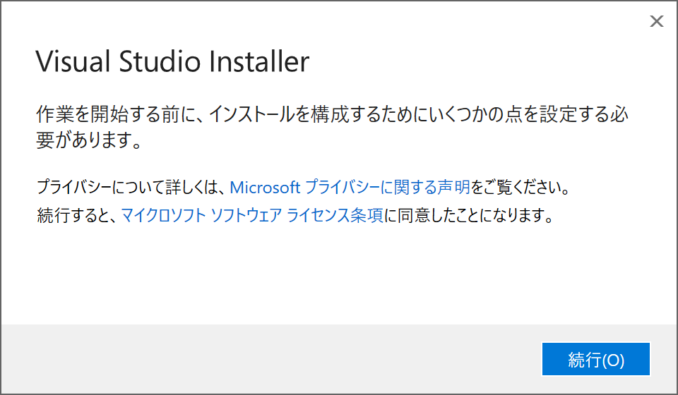

次に、Visual Studio をインストールするに際し、併せてインストールするものを選んでいきます。
Altseed2 を使った開発には「.NET Core」が必要です。
「.NET デスクトップ開発」と「.NET Core クロスプラットフォームの開発」にチェックをつけておきましょう。

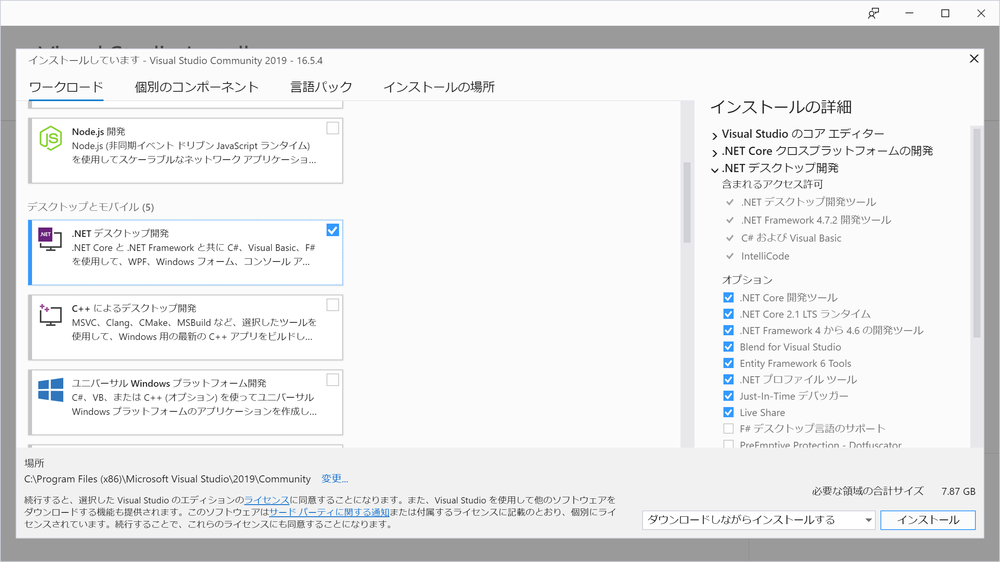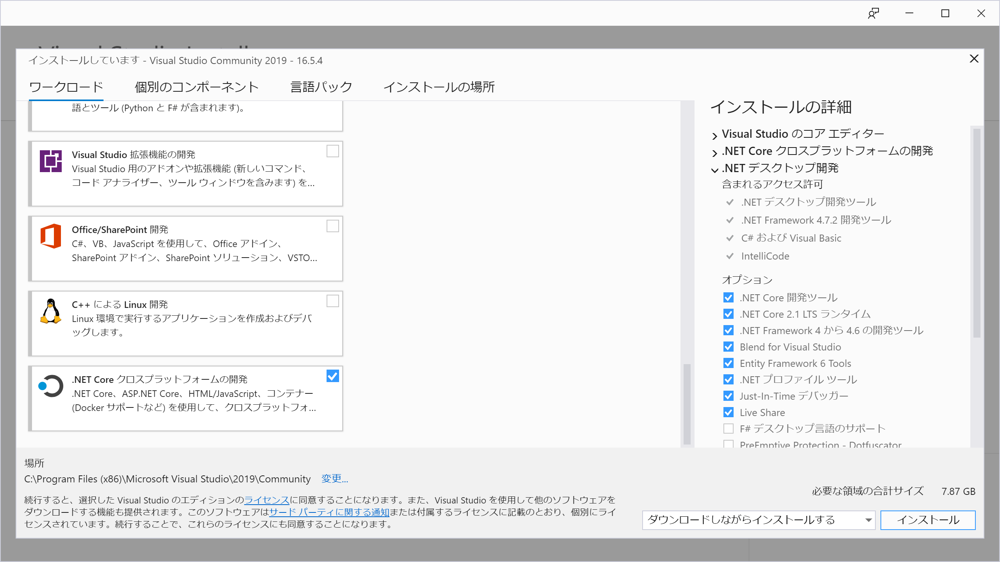

インストールしたいものが決まったら「インストール」をクリックしましょう。
インストールが始まると、次のような画面が表示されます。

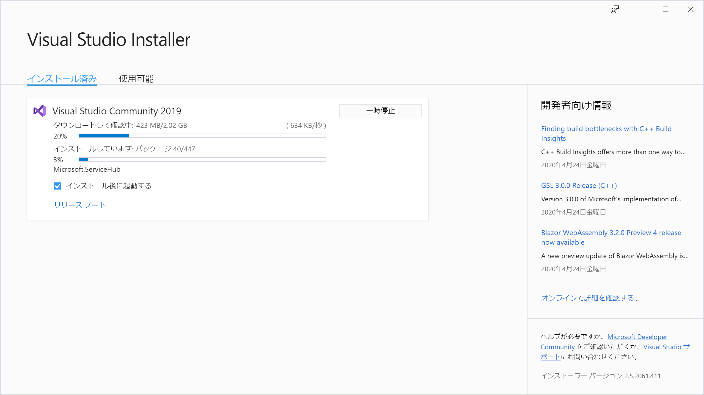

Visual Studio なるツールは、容量がとても大きいため、インストールに多くの時間を要します。
じっくり待ちましょう。

インストールが完了し、Visual Studio が起動すると、この画面が表示されるはずです。
ここまでできたら、晴れて Visual Studio の準備は完了となります。
なお、Visual Studio からサインインを求められることがありますが、これは必須ではありません。

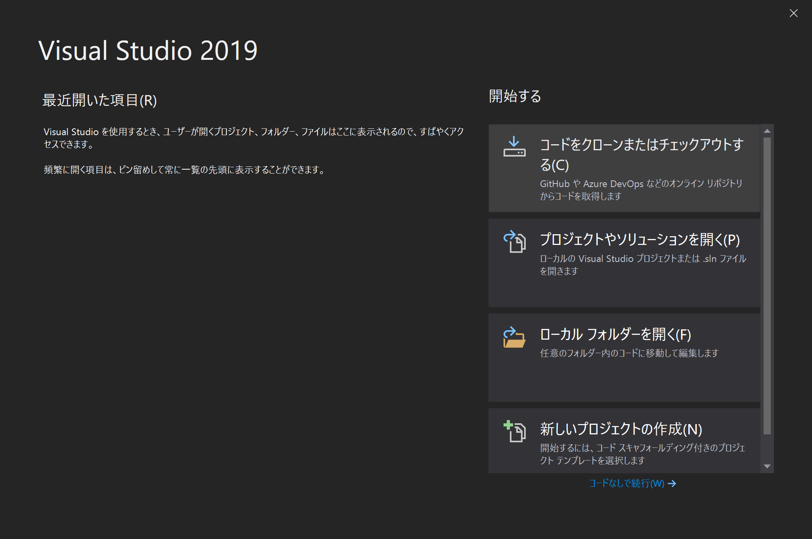

### Mac の場合
まず「Visual Studio for Mac」を選択し、インストーラをダウンロードしてください。
ダウンロードされたインストーラをクリックし、起動すると、次のようなウィンドウが出てきます。

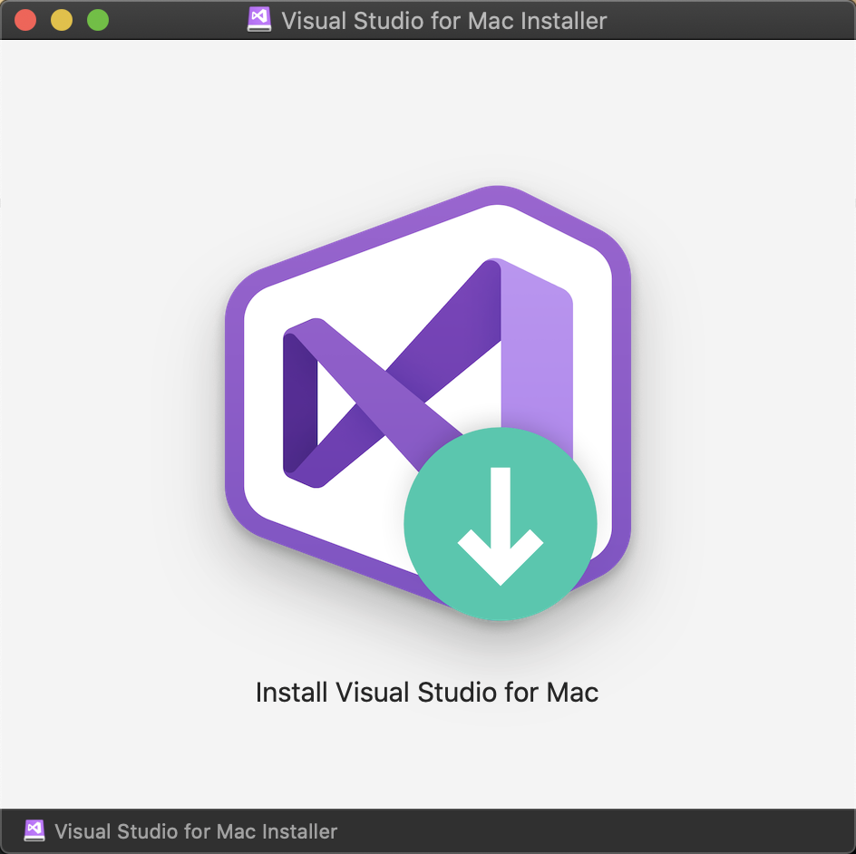

「Install Visual Studio for Mac」をクリックし、新しくウィンドウを表示させます。
暫く待って、このような画面が出たら「続行」をクリックします。  

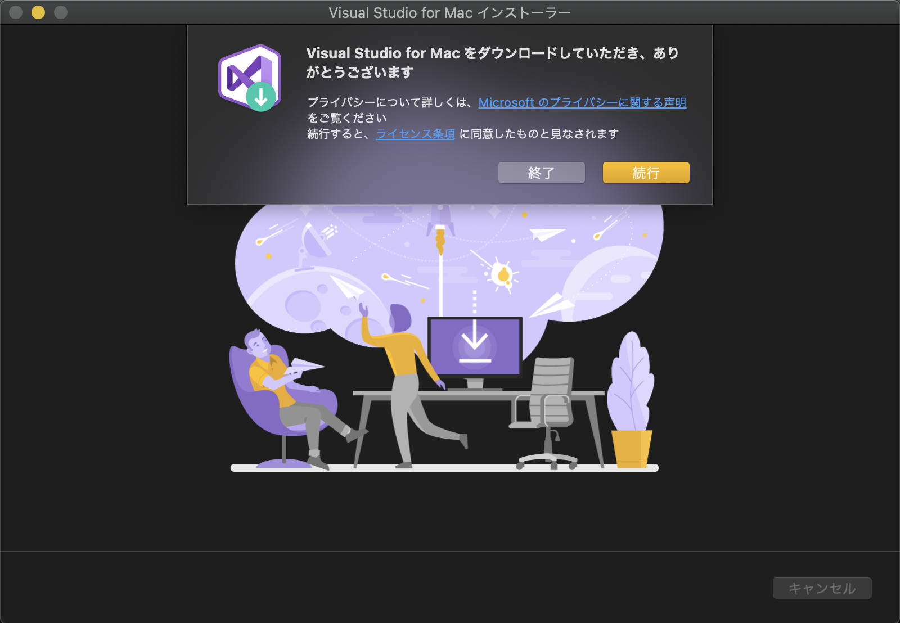

次に、Visual Studio をインストールするに際し、併せてインストールするものを選んでいきます。
Altseed2 を使った開発には「.NET Core」が必要です。
「.NET Core」にチェックをつけておきましょう。

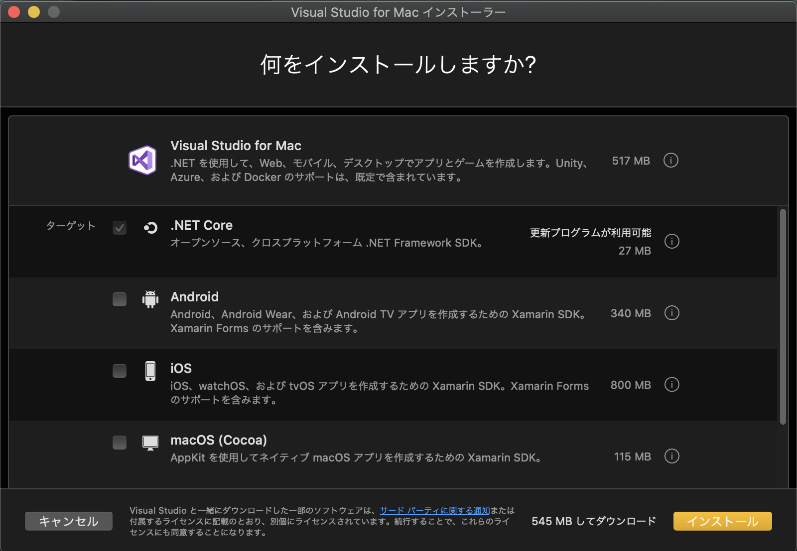

インストールしたいものが決まったら「インストール」をクリックしましょう。
インストールが始まると、次のような画面が表示されます。

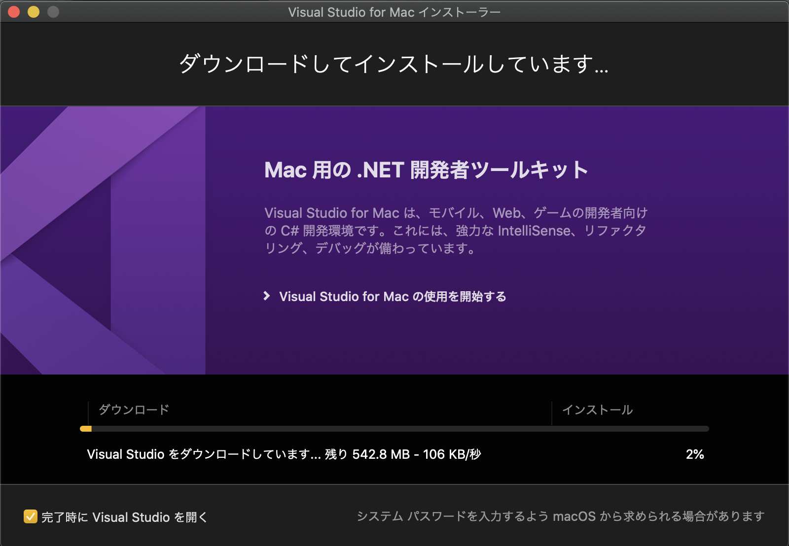

Visual Studio なるツールは、容量がとても大きいため、インストールに多くの時間を要します。
じっくり待ちましょう。
インストール中にパスワードの入力が求められることがあります。
その場合は、Mac にログインするときのパスワードを入力しましょう。  

インストールが完了し、Visual Studio が起動すると、この画面が表示されるはずです。
ここまでできたら、晴れて Visual Studio の準備は完了となります。
なお、Visual Studio からサインインを求められることがありますが、これは必須ではありません。
また、キーボードの配置を選択する画面が出てきますが、デフォルトのままで問題ないでしょう。

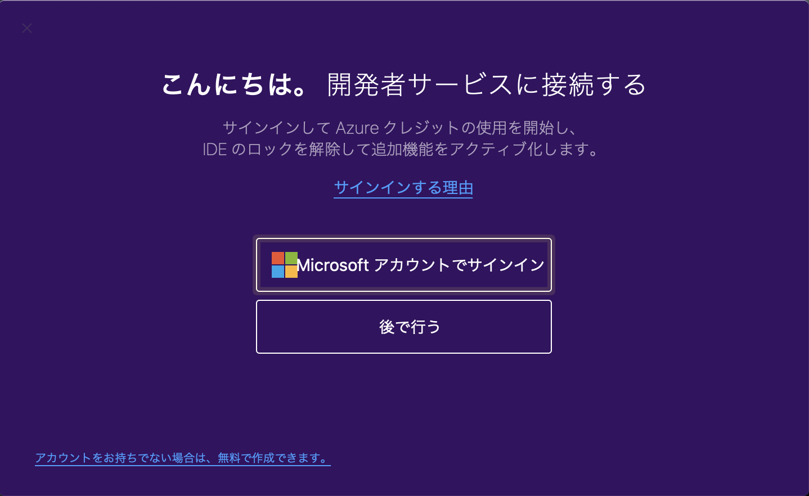

## プロジェクトの作成
インストールが終わったら、プロジェクトを作成します。
プロジェクトとは、実行可能なアプリケーションを作るために必要なファイルをまとめたものを指します。
基本的に、1 つのアプリケーションを作成するときに 1 つのプロジェクトが必要になります。

### Windowsの場合
まず、Visual Studio を起動したら「新しいプロジェクトの作成」をクリックします。  

次に、プロジェクトのテンプレートを決めます。
今回は、「コンソールアプリ (.NET Core)」を選択します。
ただし、今回は C# を使用するため、アイコンに「C#」と書かれていることを確認してください。
選択したら「次へ」をクリックします。

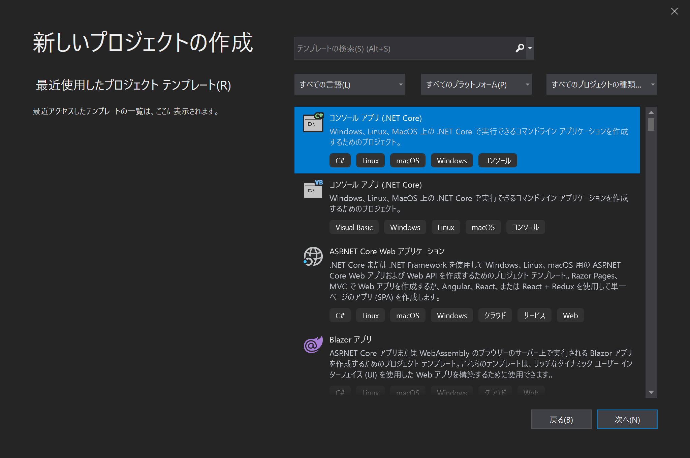

次に、プロジェクトの名前と、プロジェクトを作成する場所の設定を行います。
プロジェクトの名前は「ShootingGame」など、自由に設定してください。
それ以外の設定は変更しなくても問題ありません。

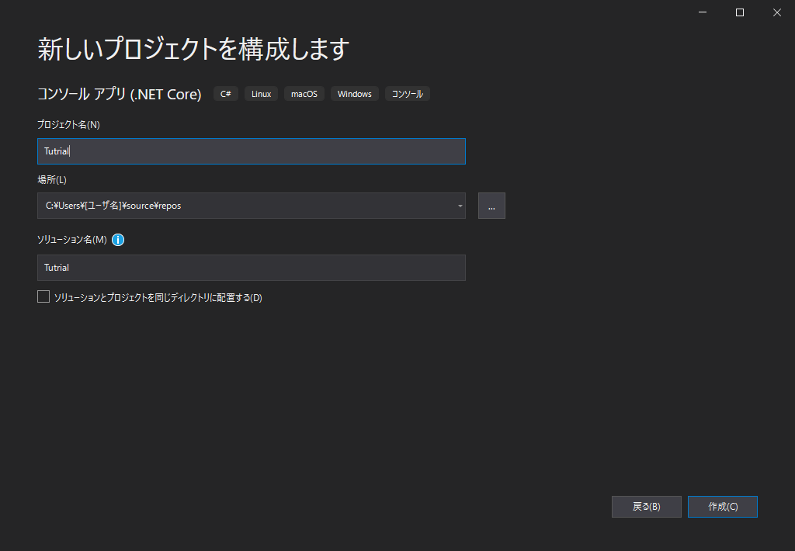

しばらく待つと、この画面が出てきます。
これが、Visual Studio のエディタ画面です。
ここまで来たら、プロジェクトの作成は完了となります。

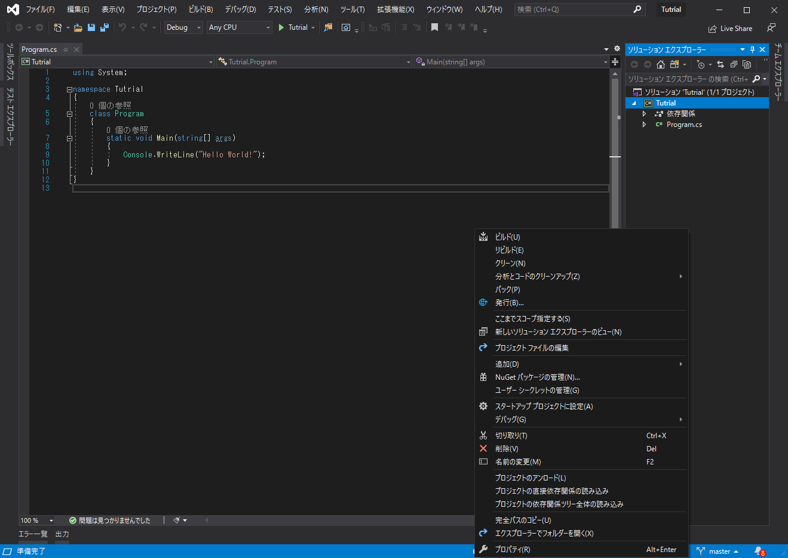

### Macの場合
まず、Visual Studio を起動したら「新規」をクリックします。

次に、プロジェクトのテンプレートを決めます。
今回は、ウィンドウ左側のメニューの中から「.NET Core」の「アプリ」をクリック、その後、ウィンドウ中央のメニューの中から「全般」の「コンソールアプリケーション」をクリックしてください。
「C# ▼」と書かれている部分をクリックすると、使用する言語を変更することができます。
しかし、今回は C# を使用するため、このままにしてください。
選択したら「次へ」をクリックします。

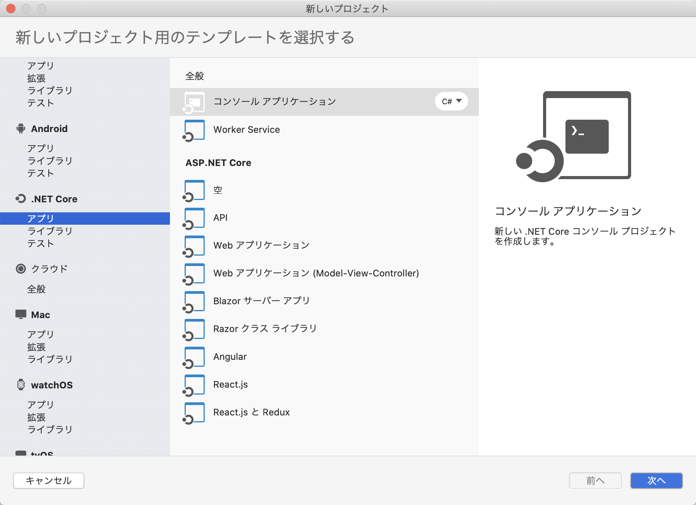

次に、プロジェクトの名前と、プロジェクトを作成する場所の設定を行います。
プロジェクトの名前は「ShootingGame」など、自由に設定してください。
それ以外の設定は変更しなくても問題ありません。

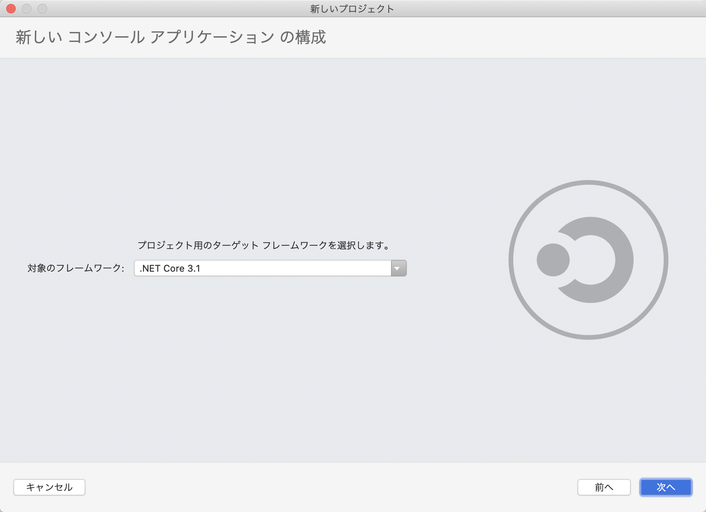

しばらく待つと、この画面が出てきます。
これが、Visual Studio のエディタ画面です。
ここまで来たら、プロジェクトの作成は完了となります。

## Altseed2 の導入
Altseed2 といった拡張機能も、導入しない限りは使うことができません。
Visual Studio には「NuGet」という、拡張機能を管理するアプリケーションが同梱されています。
今回はこの NuGet を使用して Altseed2 を導入していきます。

### Windows の場合
右側のメニューから「依存関係」をダブルクリックしてください。
すると、このような画面が表示されます。

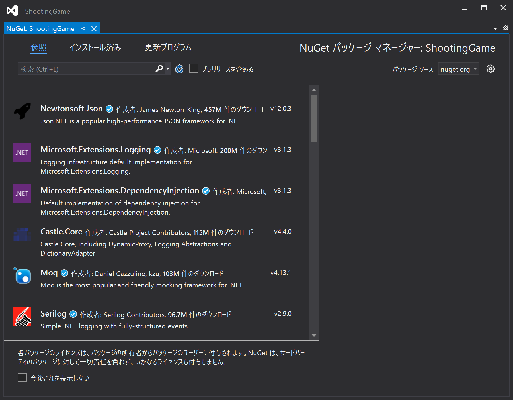

左上の検索欄から「Altseed2」と入力してください。
すると、拡張機能の一覧に「Altseed2」が出てきます。
チェックボックスにチェックを入れて「パッケージの追加」をクリックしてください。

### Mac の場合
左側のメニューから「依存関係」をダブルクリックしてください。
すると、このような画面が表示されます。

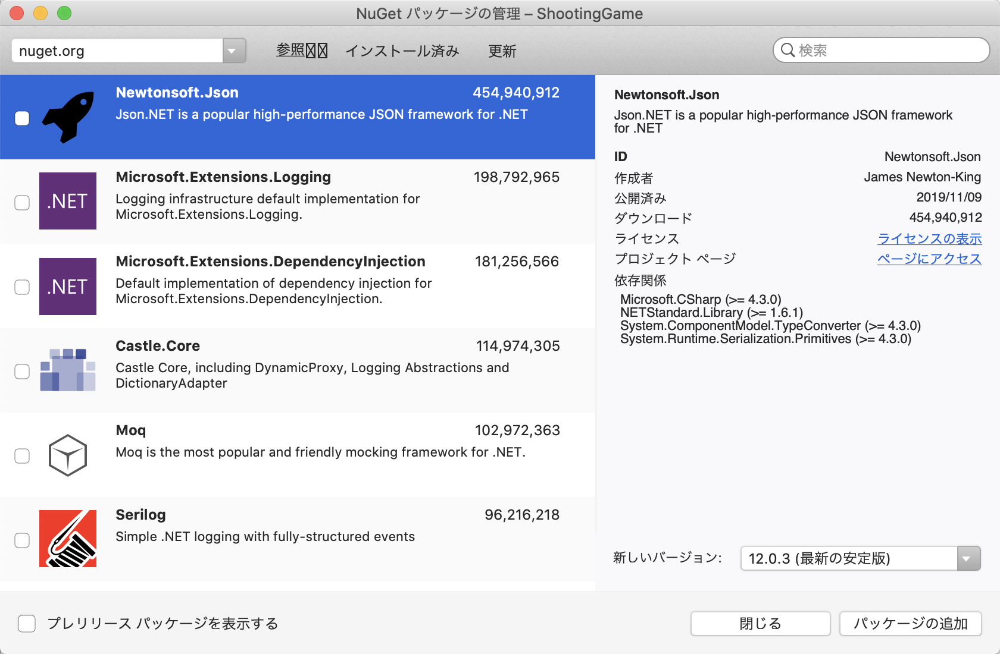

左上の検索欄から「Altseed2」と入力してください。
すると、拡張機能の一覧に「Altseed2」が出てきます。
チェックボックスにチェックを入れて「パッケージの追加」をクリックしてください。

