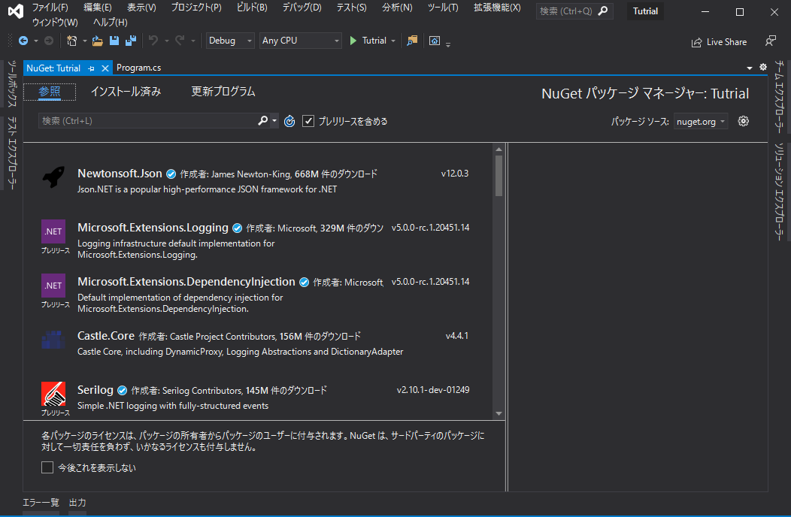

# 0章 : Altseed2 を初めよう

## このチュートリアルは何?
このチュートリアルでは、ゲームエンジン「Altseed2」を使ってシューティングゲームを開発していきます。
プログラミングをやったことがない人でも、このチュートリアルを通してある程度のクオリティのシューティングゲームを作れるようになります。  

このチュートリアルでは、開発に使用するプログラミング言語として C#を用います。
C#の文法自体は本文中でも軽く説明しますが、ある程度 C#の知識を身につけておくと読みやすくなるでしょう。
C#のより詳しい解説は、[C#によるプログラミング入門](https://ufcpp.net/study/csharp/)にわかりやすく纏まっています。
C#の文法や機能について不明な点があった場合は、是非一読してみてください。
また、C#の学習を円滑なものにするため、各章の冒頭に新たに導入される C#の機能とその解説へのリンクを記載しています。
C#の機能をもっと知りたい、本文を読んでもよく分からなかったという場合は、そちらをご参照ください。  

なお、このチュートリアルは、Windowsユーザ及び Mac ユーザを想定しています。

## チュートリアルを始める前に
この章の目標は、C#とAltseed2を使って開発を進める前に、必要なツールを導入しておくことです。
ゲームに限らず、どんなアプリケーションを開発するにしても、そのための環境が必要になります。
ここでいう環境とは、アプリケーションを開発するために必要なツールやシステムの組み合わせのことを指します。
すなわち、ゲームを開発する準備段階として、開発に必要なツールを揃えておかなければなりません。
それでは早速必要なツールを導入してみましょう。

## Visual Studioのインストール
WindowsやMacで C#を使用してアプリケーションを開発するには、Visual Studioというツールが必要になります。
Visual Studioは、プログラムのソースコードから実行可能なアプリケーションを生成するツールです。
Visual Studioのインストーラは [Visual Studioのウェブページ](https://visualstudio.microsoft.com/ja/downloads/)からダウンロードすることができます。

### Windows の場合
まず「Visual Studio2019」の「コミュニティ」を選択し、インストーラをダウンロードしてください。
ダウンロードされたインストーラをクリックし、起動すると、次のようなウィンドウが出てきます。
「続行」をクリックしてください。

次に、Visual Studioをインストールするに際し、併せてインストールするものを選んでいきます。
Altseed2 を使った開発には「.NET Core」が必要です。
「.NET デスクトップ開発」と「.NET Core クロスプラットフォームの開発」にチェックをつけておきましょう。

インストールしたいものが決まったら「インストール」をクリックしましょう。
インストールが始まると、次のような画面が表示されます。

Visual Studioなるツールは、容量がとても大きいため、インストールに多くの時間を要します。
じっくり待ちましょう。

インストールが完了し、Visual Studioが起動すると、この画面が表示されるはずです。
ここまでできたら、晴れて Visual Studioの準備は完了となります。
なお、Visual Studioからサインインを求められることがあります。
ライセンス認証に必須ですが、今すぐ必要ということはないため、あとでやっておきましょう。

### Mac の場合
まず「Visual Studio for Mac」を選択し、インストーラをダウンロードしてください。
ダウンロードされたインストーラをクリックし、起動すると、次のようなウィンドウが出てきます。

「Install Visual Studio for Mac」をクリックし、新しくウィンドウを表示させます。
暫く待って、このような画面が出たら「続行」をクリックします。  

次に、Visual Studioをインストールするに際し、併せてインストールするものを選んでいきます。
Altseed2 を使った開発には「.NET Core」が必要です。
「.NET Core」にチェックをつけておきましょう。

インストールしたいものが決まったら「インストール」をクリックしましょう。
インストールが始まると、次のような画面が表示されます。

Visual Studioなるツールは、容量がとても大きいため、インストールに多くの時間を要します。
じっくり待ちましょう。
インストール中にパスワードの入力が求められることがあります。
その場合は、Mac にログインするときのパスワードを入力しましょう。  

インストールが完了し、Visual Studioが起動すると、この画面が表示されるはずです。
ここまでできたら、晴れて Visual Studioの準備は完了となります。
なお、Visual Studioからサインインを求められることがあります。
ライセンス認証に必須ですが、今すぐ必要ということはないため、あとでやっておきましょう。
また、キーボードの配置を選択する画面が出てきますが、デフォルトのままで問題ないでしょう。

## プロジェクトの作成
インストールが終わったら、プロジェクトを作成します。
プロジェクトとは、実行可能なアプリケーションを作るために必要なファイルをまとめたものを指します。
基本的に、1 つのアプリケーションを作成するときに 1 つのプロジェクトが必要になります。

### Windowsの場合
まず、Visual Studioを起動したら「新しいプロジェクトの作成」をクリックします。  

次に、プロジェクトのテンプレートを決めます。
今回は、「コンソールアプリ (.NET Core)」を選択します。
ただし、今回は C#を使用するため、アイコンに「C#」と書かれていることを確認してください。
選択したら「次へ」をクリックします。

次に、プロジェクトの名前と、プロジェクトを作成する場所の設定を行います。
プロジェクトの名前は「ShootingGame」など、自由に設定してください。
それ以外の設定は変更しなくても問題ありません。
ただし、プロジェクトを作成した場所は、どこかに記録するなどして覚えておきましょう。

しばらく待つと、この画面が出てきます。
これが、Visual Studioのエディタ画面です。
ここまで来たら、プロジェクトの作成は完了となります。

### Macの場合
まず、Visual Studioを起動したら「新規」をクリックします。

次に、プロジェクトのテンプレートを決めます。
今回は、ウィンドウ左側のメニューの中から「.NET Core」の「アプリ」をクリック、その後、ウィンドウ中央のメニューの中から「全般」の「コンソールアプリケーション」をクリックしてください。
「C#▼」と書かれている部分をクリックすると、使用する言語を変更することができます。
しかし、今回は C#を使用するため、このままにしてください。
選択したら「次へ」をクリックします。

次に、プロジェクトの名前と、プロジェクトを作成する場所の設定を行います。
プロジェクトの名前は「ShootingGame」など、自由に設定してください。
それ以外の設定は変更しなくても問題ありません。
ただし、プロジェクトを作成した場所は、どこかに記録するなどして覚えておきましょう。

しばらく待つと、この画面が出てきます。
これが、Visual Studioのエディタ画面です。
ここまで来たら、プロジェクトの作成は完了となります。

## Altseed2 の導入
Altseed2 といった「拡張機能」も、導入しない限りは使うことができません。
Visual Studioには「NuGet」という、拡張機能を管理するアプリケーションが同梱されています。
今回はこのNuGetを使用してAltseed2を導入していきます。

### Windows の場合
右側のメニューから「依存関係」を右クリックして、「NuGetパッケージの管理」をクリックしてください。
すると、このような画面が表示されます。

左上の検索欄から「Altseed2」と入力してください。
すると、拡張機能の一覧に「Altseed2」が出てきます。
「Altseed2」を選択して、「インストール」をクリックしてください。
「インストール」をクリックすると、次のような画面が表示されます。
「OK」をクリックして、インストールを開始してください。

しばらく待つと、このような画面が表示されます。
「同意する」をクリックしてください。

このように、右側のメニューの「依存関係」の下に3つほどファイルが追加されれば、Altseed2 の導入も完了です。

### Mac の場合
左側のメニューから「依存関係」をダブルクリックしてください。
すると、このような画面が表示されます。

左上の検索欄から「Altseed2」と入力してください。
すると、拡張機能の一覧に「Altseed2」が出てきます。
チェックボックスにチェックを入れて「パッケージの追加」をクリックしてください。
しばらく待つと、このような画面が表示されます。
「同意する」をクリックしてください。

このように、「Altseed2 は正常に追加されました。」という表示が出れば、Altseed2 の導入も完了です。

## ゲームに使用する画像や音声を用意する
さて、これでゲームを開発するために必要最低限のツールは全て出揃いました。
これだけでゲームを作ってもいいのですが、より多彩な表現を盛り込むためには、画像や音声のファイルを用意する必要があります。
今回開発するゲームで使用する画像や音声は、下記のリンクからダウンロードすることができます。

[リソースファイル](https://github.com/altseed/Altseed2-document/blob/master/Tutorials/Resources.zip?raw=true)

まず、ダウンロードして得られたzipファイルを解凍します。
次に、解凍したzipファイルの中身を、指定した場所に配置します。
Windowsの場合は、`~/source/repos/ShootingGame/ShootingGame/bin/Debug/netcoreapp3.1`に配置してください。
Macの場合は、`~/Projects/ShootingGame/ShootingGame/bin/Debug/netcoreapp3.1`に配置してください。
このようにすることで、ゲームから画像や音声のデータを使用することができます。

## まとめと次回予告
今回は、Visual Studio と Altseed2 の導入作業をしてきました。
「プロジェクトの作成」や「Altseed2 の導入」は、常にこの手順で行うため、覚えておくと吉です。

次回からいよいよ、シューティングゲームの開発を行っていきます。
