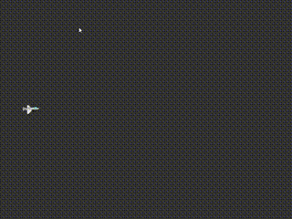

# 2章 : キャラクターを描画してみよう
全章では、ウィンドウを表示するところまで進みました。
この章では自機となるキャラクターを表示し、移動させるところまで進みます。

## キャラクターの描写

まずは、キャラクターを表示してみましょう。

以下のコードを追加します。

[!code-diff[Main](Text/Spl1.cs)]

これを実行してみると、キャラクターが表示されているのが確認できると思います。


追加したコードしていることは、15行目から順に
* SpriteNodeインスタンスを生成し、"player"に格納する。
* 自機の画像を読み込み、playerのテクスチャに設定する。
* 自機の座標を x: 100 / y: 360 に設定する。
* 自機の中心座標を、自機のテクスチャ画像サイズの縦横それぞれの半分だけずらした位置に設定する。

となります。

> [!NOTE]
> **自機の中心座標**
> 
> 自機の中心座標は、自機画像の左上を原点(0,0)とした相対座標になります。デフォルトの中心座標は原点、つまり左上になります。
> 
> ここでやっている中心座標の操作は、キャラクターの移動や距離の計算等で色々不便になるため、中心座標を真ん中に持ってくるようにしています。

ここで`ContentSize`とありますが，これは自機のサイズを表します。この自機のサイズは読み込んだテクスチャのサイズが用いられます。
今後オブジェクトの大きさを取得したくなったら，`サイズを取得したいオブジェクト.ContentSize`としましょう。

## キャラクターの移動

次は、表示したキャラクターを移動させてみましょう。

以下のコードを追加します。

[!code-diff[Main](Text/Spl2.cs)]

このコードを追加すると、キャラクターが画面上方向に進めるようになるはずです。



この追加したコードがしていることは、34行目から順に
* 上矢印キーの状態が、ホールド（押しっぱなし）の状態であるかどうかを確認。
* 上の条件が真であれば、"player"の座標(position)に x: 0.0 / y: -2.5 を足す。

ということです。

> [!NOTE]
> **+= って何？**
>
> 「+=」という見慣れない記号が気になった人もいるでしょう。
> これは下の式と同じことを示しています。
> ```
> player.Position = player.Position + new Vector2F(0.0f, -2.5f);
> ```
> プレイヤーの移動は、プログラム的にはプレイヤーの座標を書き換えつづけることで実現するわけですが、
> 
> 移動は「今プレイヤーがいる座標を基準にして、そこから〇〇だけ移動する」と考えたほうがわかりやすいですね。
>
> ですから、「プレイヤーの座標に、今のプレイヤーの座標に(0.0, -2.5)だけ加えた座標を代入する。」という操作を行います。
> 
> このような操作はプログラミングではよく用いるため、省略してかけるようになっています。それが「+=」というわけです。


この数字の後ろにある"f"ですが、これはその数字が浮動小数点数型であることを示しています。

キーボードのあるキーが押されているかどうか確認したいときは、

` Engine.Keyboard.GetKeyState(Key.ここに確認したいキーを入れる) `

を用います。

詳しくは以下を参照してください。

[Keyboard](~/Manual/Input/Keyboard.md)

#### 左右上下に移動

では、同様にして、下・左右方向にも動けるようにしてみましょう。

[!code-diff[Main](Text/Spl3.cs)]

上方向に進むコードの状態を取得するキーと、座標の足す(引く)値を変更すれば、
下・左右方向にも進めるようになりますね。

さて、一番下に追加した「Escapeキーでゲーム終了」ですが、
これはESCキーを押した時にゲームループを抜ける、つまりゲームのような処理になっています。

つまり、ゲームの終了ボタンですね。

以上で自機キャラクターの表示と移動ができるようになりました！
次の章では弾を撃てるようにしていきます。
