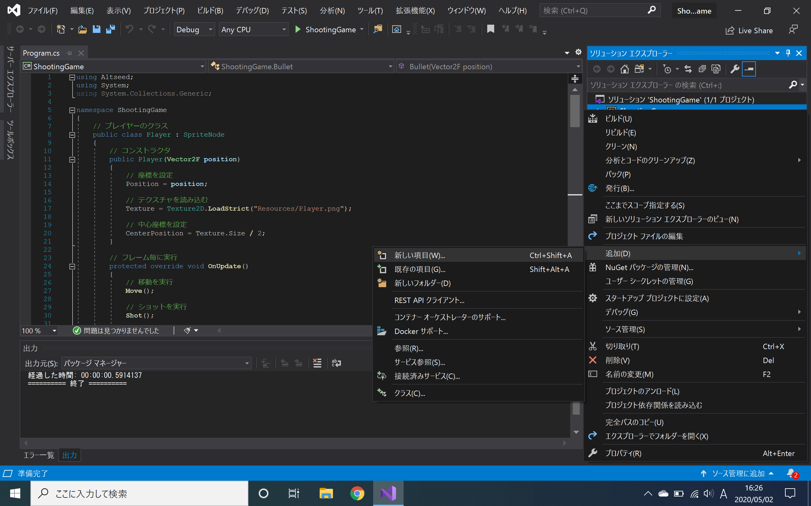
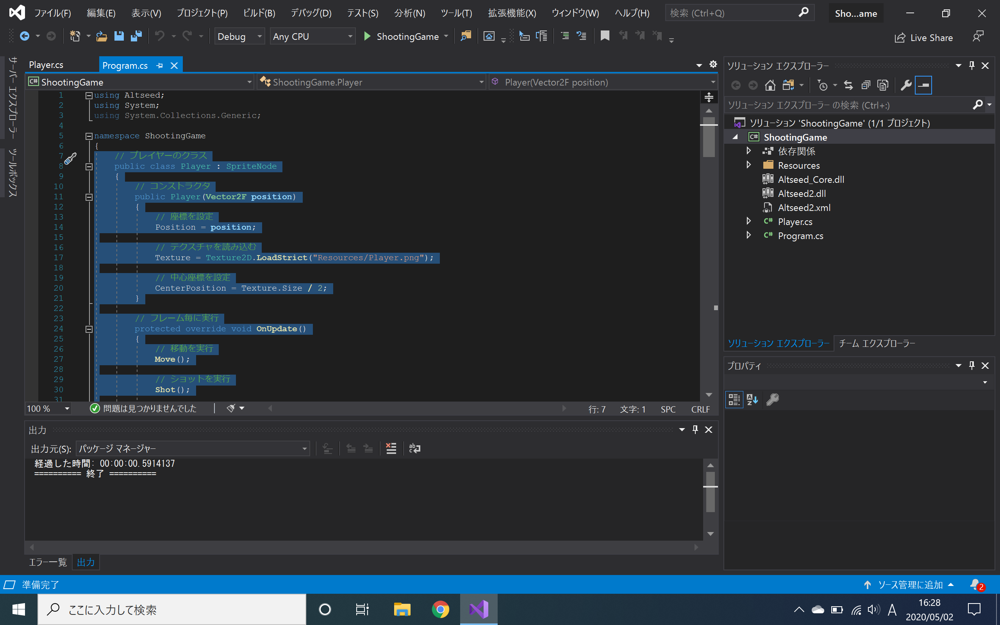
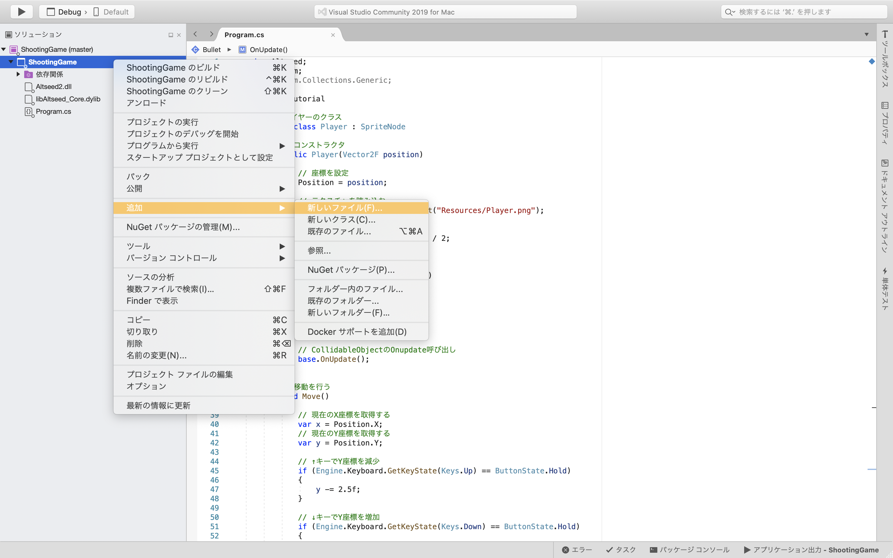

# 4章 : クラスを自分で設計してみよう

前章ではキャラクターが弾を撃つようになりました。
しかし、このまま新しい要素を`Main`メソッドに書き込んでいくと、ソースコードは段々と長く、わかりにくくなっていきます。
そこで、今回はソースコードを整理して、キャラクターと弾の処理を個別に行えるようにしましょう。

## 新たに導入する知識
- [C#によるプログラミング入門 : 関数](https://ufcpp.net/study/csharp/st_function.html)
- [C#によるプログラミング入門 : 継承](https://ufcpp.net/study/csharp/oo_inherit.html)

## プレイヤーを動かす処理をメソッドを使って整理する
プレイヤーや弾を移動させるソースコードが`while`文の中に書き込まれていたため、`while`文の中の処理が長くなっていました。
今はまだプレイヤーの移動と弾の発射だけなので、そこまで読みにくく感じることはないかもしれません。
しかし、ここに敵の追加や移動などの処理を加えると、ソースコードはどんどん長く、わかりにくくなっていきます。
しまいには開発者本人でさえ読めなくなってしまいます。
そこでまずは、メソッドを使って一連の処理をまとめていきましょう。  

手始めに、キャラクターの移動に関する処理をメソッドで表現します。

[!code-diff[Main](Spl1.cs)]

ソースコードでは、以下のようにメソッドを追加しました。

``` C#
static void MovePlayer(SpriteNode player)
{
    ......
}
```

`MovePlayer`メソッドは引数`player`の移動に関する処理を行います。
`MovePlayer`メソッドの中の処理は、以下のように記述することで呼び出されます。

``` C#
MovePlayer(player);
```

このように変更して、作成したプログラムを実行してみてください。
挙動は全く変わらないはずです。

## プレイヤーを動かす処理を継承を使って整理する
`Main`メソッドの中身がある程度すっきりしましたね。
しかし、これだけでは C#の良さは活かしきれません。
C#の機能にクラスというものがあったことを思い出してください。
ここからは、そのクラスを自分で設計していきましょう。

まず、プレイヤーに相当するクラスを追加します。

[!code-diff[Main](Spl2.cs)]

ソースコードでは、以下のようにクラスを追加しました。

``` C#
class Player : SpriteNode
{
    ......
}
```

第2章で、`SpriteNode`は設計図であると述べました。
この変更では、`SpriteNode`という設計図を利用して、`Player`という新たな設計図を作成しています。
この機能を「継承」と呼びます。

また、`var player = new SpriteNode();`の部分が`var player = new Player();`に変化しています。
このようにすることで、`player`は`Player`クラスのインスタンスになります。

この`Player`クラスには、新たな機能が何も追加されていません。
そこで、プレイヤーを動かす処理を`Player`クラスの内部に持っていきます。

[!code-diff[Main](Spl3.cs)]

`MovePlayer`メソッドの処理を、`Player`クラスの`Move`メソッドに移動させました。
`Player`クラスは、継承元である`SpriteNode`クラスの情報を持っているため、`Position`や`Texture`が自身の情報となります。
したがって`Move`メソッドの中では、たとえば`player.Position`とはせずに、単に`Position`と記述します。
また、`Main`メソッドからの呼び出し方が変わり、`player.Move()`とします。

続いて、Altseed2のUpdate機能を使って、`Player`クラスの更新を`Player`クラスの内部で行えるようにしましょう。

[!code-diff[Main](Spl4.cs)]

`OnUpdate`は、Altseed2が更新されるたびに実行されるメソッドです。
この中に`Move`メソッドを加えることで、今までと同じように`Move`メソッドがAltseed2が更新されるたびに実行されます。

``` C#
protected override void OnUpdate()
{
    ......
}
```

`override`は、継承元のメソッドの名前を使って処理を上書きするための機能です。
単に`OnUpdate`と記述するだけでなく、`override`も併せて記述しなければ、正しい動作は望めません。

なお、`public void Move()`の部分が`void Move()`に変化していることが見て取れます。
`public`や`protected`の説明は次の章にて行います。

## 弾を動かす処理を継承を使って整理する
今度は、先ほどと同じようにして弾のソースコードを整理していきます。
弾に相当するクラスを追加しましょう。

[!code-diff[Main](Spl5.cs)]

`Bullet`クラスを追加しました。

```C#
public class Bullet : SpriteNode
{
    ...
}
```

また、`var bullet = new SpriteNode();`の部分が`var bullet = new Bullet();`に変化しています。
このようにすることで、`bullet`は`Bullet`クラスのインスタンスになります。
更新処理が`Bullet`クラスに記述されていることで、更新するたびに弾自身が自分で移動するようになります。
そのため、`List`による管理が必要なくなります。

## 弾を撃つ処理をプレイヤーに移動する
弾を撃っているのはプレイヤーなので、弾を撃つ処理をプレイヤーに移動してみましょう。

[!code-diff[Main](Spl6.cs)]

プレイヤーに関する処理のほとんどが`Player`クラスに移動しましたね。
`Main`メソッドの`while`文の中身がAltseed2の更新処理だけになりました。
ここまで変更したプログラムを実行してみてください。
挙動は全く変わらないはずです。

## コンストラクタを使って初期値を設定する
大分、処理がクラスにまとまってきました。
しかし、画像と最初の位置の指定がクラスの外で行われています。
これら初期値の設定も、クラスの中で行いたいものです。
そこで登場するのが「コンストラクタ」です。

[!code-diff[Main](Spl7.cs)]

コンストラクタは、インスタンスが生成されたときに実行されるメソッドの一種です。
インスタンス生成と同時に画像を読み込むには、このコンストラクタにその処理を記述します。
また、コンストラクタはメソッドであり、引数を持つことができます。
ソースコードでは、`Player`クラスと`Bullet`クラスのコンストラクタに、引数　`position`を持たせています。
このようにすることで、プレイヤーや弾の最初の位置を外部から設定できるようになります。

## プレイヤーが画面外に出ないようにする
ここまででできたプログラムを実行してわかると思いますが、方向キーを押しっぱなしにしていると、プレイヤーが画面外に出てしまいます。
そこで、プレイヤーが画面外に出ないように、処理を追加する必要があります。

[!code-diff[Main](Spl8.cs)]

追加した処理では、変更後の x 座標と y 座標について、画面に表示される範囲に収まるように数値を設定しています。
このようにすることで、プレイヤーが画面外に出ることはなくなります。

## 弾が画面外に出たら消える処理を追加する
弾はいずれ画面外に出ていきます。
しかし、画面外に出た弾を削除せずに、エンジンに弾を追加していくと、エンジンの処理が重くなっていきます。
そのため、弾が画面外に出て行ったら削除する処理を追加する必要があります。

[!code-diff[Main](Spl9.cs)]

弾が画面外に出たら、親ノードを取得して`RemoveChildNode`メソッドを実行します。
このメソッドを実行すると、弾のインスタンスはAltseed2の管理対象から除外されます。
すなわち、画面外に出た弾は管理されなくなるということです。
これにて、画面外の弾が消えないも解決です。

## クラスごとにファイルを分ける
さて、ここまでソースコードをProgram.csに書き込んできたわけですが、行数が多くなり、見通しも悪くなってきました。
そこで、新しい C#のソースファイルを追加して、ソースコードを切り分けていきましょう。

### Windows の場合
まず、下図に示すように、「ShootingGame」の青く示された部分を右クリックしてください。
その後、選択肢のウィンドウが出てくるので、「追加」、「新しい項目」の順にクリックしてください。



すると、「新しい項目の追加 - ShootingGame」というウィンドウが表示されます。
ウィンドウが表示されたら、画面左側の選択肢から「コード」を選択し、その後、画面中央の選択肢から「クラス」を選択します。
次に、画面下側の入力ボックスに、ファイル名を入力します。
今回は`Player`クラスを別のファイルに移動したいため、ファイル名を「Player.cs」とします。
入力が終わったら、「追加」をクリックします。


ここまで終わったら、「ソリューション」のところに「Player.cs」が追加されているはずです。
あとは、Program.csに記述されている`Player`クラスの部分を切り取って、Player.csに貼り付けるだけです。
ただし、ただ切り貼りしただけではエラーが発生します。
その場合は、Player.csの内容を適宜変更しておきましょう。



これと同様の手順を踏んで、Bullet.csを追加し、`Bullet`クラスを移してみてください。

### Mac の場合
まず、下図に示すように、「ShootingGame」の青く示された部分を右クリックしてください。
その後、選択肢のウィンドウが出てくるので、「追加」、「新しいファイル」の順にクリックしてください。



すると、「新しいファイル」というウィンドウが表示されます。
ウィンドウが表示されたら、画面左側の選択肢から「General」を選択し、その後、画面中央の選択肢から「空のクラス」を選択します。
次に、画面下側の入力ボックスに、ファイル名を入力します。
今回は`Player`クラスを別のファイルに移動したいため、ファイル名を「Player」とします。
入力が終わったら、「新規」をクリックします。


ここまで終わったら、「ソリューション」のところに「Player.cs」が追加されているはずです。
あとは、Program.csに記述されている`Player`クラスの部分を切り取って、Player.csに貼り付けるだけです。
ただし、ただ切り貼りしただけではエラーが発生します。
その場合は、Player.csの内容を適宜変更しておきましょう。


これと同様の手順を踏んで、Bullet.csを追加し、`Bullet`クラスを移してみてください。

## プレイヤーや弾をまとめて管理できるようにする

ソースコードが複数のファイルに振り分けられたことで、Program.csの内容がこれだけになりました。

[!code-diff[Main](Spl10.cs)]

しかし、このソースコードでは、プレイヤーや弾を、エンジンに直接登録してしまっています。
このままでは、何か別の画面に切り替えようとした場合に、エンジンに直接登録されたオブジェクトをいちいち登録解除するのが面倒です。
そこで、プレイヤーや弾をまとめて管理できる、すなわちメインステージを追加しておきましょう。

まず、新しくMainNode.csを作成します。
手順は、先ほどソースコードを振り分ける時に行ったものと同じです。

ファイルを新規作成できたら、メインステージを表す`MainNode`クラスに処理を書き込んでいきます。
MainNode.csに以下のように書いてください。

[!code-diff[Main](Spl11.cs)]

`OnAdded`は、このノードがエンジンに登録されたときに実行されるメソッドです。
ノードの初期状態を設定するには、このメソッドを使います。

``` C#
protected override void OnAdded()
{
    ......
}
```

さて、`MainNode`クラスは、ノードを表す`Node`クラスを継承しています。
こうすることで、`MainNode`クラスのインスタンスは、エンジンに登録されるノードとして作用します。
このノードにプレイヤーや弾を登録することで、これらをまとめて管理できるというわけです。

また、`MainNode`の中にも、`characterNode`や`uiNode`のような、`Node`クラスのインスタンスがあります。
同じ画面の中でも、プレイヤーや弾といったゲーム中のオブジェクトと、残機や得点といった UI に関わるオブジェクトを、それぞれまとめて管理したいものです。
このように、`Node`クラスのインスタンスをうまく利用することで、系統ごとにオブジェクトをまとめて管理することができます。

では、`MainNode`クラスのインスタンスを作成し、それをエンジンに登録してみましょう。
Program.csに移って、以下のようにソースコードを書き換えてください。

[!code-diff[Main](Spl12.cs)]

このようにすると、`MainNode`の子ノードとして登録されているオブジェクト群が更新され、先ほどと同じ挙動をします。

## 背景を追加する
ソースコードが整理できたので、ここから敵を追加していっても良い頃合いです。
しかしその前に、プレーンな背景で繰り広げられるゲームは、いまいち面白みに欠けますよね。
それっぽい背景が欲しいものです。
ということで、`MainNode`に背景を追加する機能を追加しておきましょう。

[!code-diff[Main](Spl13.cs)]

シューティングゲームらしい絵面になりました。

## まとめと次回予告
今回は、C#のオブジェクト指向の機能を活用して、ソースコードを整理し、その過程で新たな機能を追加してきました。
このように、機能ごとにクラスを分けておくことで、ソースコードが読みやすくなります。
それによって、プログラムが落ちるなど、予期しない挙動が発生したとき、その原因となっている箇所を見つけやすくもなります。
クラスを自分で設計するということは、初めのうちは難しいかもしれません。
しかし、慣れていくと、自由自在にクラスを設計することができるようになります。

次回からやっと、敵機・敵弾を追加していきます。