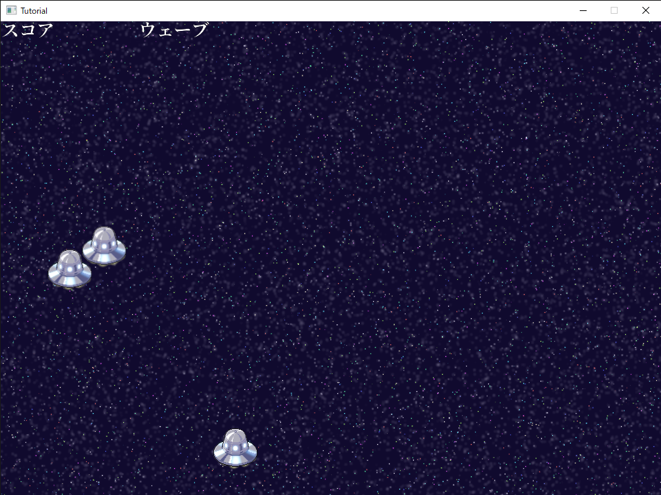
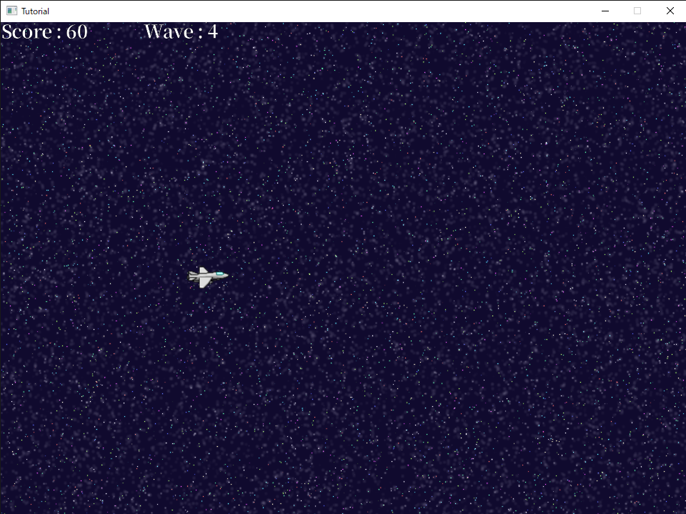

# 8章 : スコアを表示してみよう

前章では音を鳴らすところまで進みました。

今回は5章で設定したスコア(score)と現在のウェーブ数を、画面に表示してみましょう！

まずは、スコア・ウェーブ数を表示させるためのTextNodeを作り、それを表示するところまでやってみます。

これが表示できたら、あとは表示するテキストをスコアもしくはウェーブ数に切り替えます。

## テキストを表示

まずは、スコア表示用のTextNodeを追加していきます。

以下のコードを追加してください。

``` diff
namespace Tutorial
{
    // メインステージのクラス
    public class MainNode : Node
    {
        // BGMのID
        private int? bgmID = null;

        // カウンタ
        private int count = 0;

        // ウェーブの個数
        private const int waves = 3;

        // 現在ウェーブ
        private int wave = 1;

        // 敵を格納するキュー
        private Queue<Enemy>[] enemies = new Queue<Enemy>[waves];

        // キャラクターを表示するノード
        private Node characterNode = new Node();
        
        // プレイヤーの参照
        private Player player;

+       // スコアを表示するノード
+       private TextNode scoreNode;
+
+       // 現在ウェーブを表示するノード
+       private TextNode waveNode;

        // スコア
        public int score;

        // エンジンに追加された時に実行
        protected override void OnAdded()
        {

          .
          .
          .
```

二つのTextNode用の変数を書いたら、

次はこのTextNodeの設定していきます。


``` diff
        // エンジンに追加された時に実行
        protected override void OnAdded()
        {
            // キャラクターノードを追加
            AddChildNode(characterNode);

            // UIを表示するノード
            var uiNode = new Node();

            // UIノードを追加
            AddChildNode(uiNode);

            // 背景に使用するテクスチャ
            var backTexture = new SpriteNode();
            // 背景のテクスチャを読み込む
            backTexture.Texture = Texture2D.LoadStrict("Resources/Background.png");
            // 表示位置を奥に設定
            backTexture.ZOrder = -100;

            // 背景テクスチャを追加
            AddChildNode(backTexture);

            // プレイヤーを設定
            player = new Player(this, new Vector2F(100, 360));

            // キャラクターノードにプレイヤーを追加
            characterNode.AddChildNode(player);

+           // スコアを表示するノードを設定
+           scoreNode = new TextNode();
+           // スコア表示に使うフォントを読み込む
+           scoreNode.Font = Font.LoadDynamicFontStrict("Resources/GenYoMinJP-Bold.ttf", 30);
+           // スコア表示の位置を設定
+           scoreNode.Position = new Vector2F();
+           // スコア表示に仮テキストを設定
+           scoreNode.Text = "スコア";
+
+           // UIノードにスコア表示ノードを追加
+           uiNode.AddChildNode(scoreNode);
+
+           // 現在ウェーブを表示するノードを設定
+           waveNode = new TextNode();
+           // ウェーブ表示に使うフォントを読み込む
+           waveNode.Font = Font.LoadDynamicFontStrict("Resources/GenYoMinJP-Bold.ttf", 30);
+           // ウェーブ表示の座標を設定
+           waveNode.Position = new Vector2F(200, 0);
+           // ウェーブ表示に仮テキストを設定
+           waveNode.Text = "ウェーブ";
+
+           // ウェーブ表示ノードを追加
+           uiNode.AddChildNode(waveNode);

            // 全てのウェーブを初期化する
            InitAllWave();

            // BGMを初期化する
            InitBGM();
        }
```

設定した内容は、
* TextNodeインスタンスの代入
* フォントの読み込みと設定
* 表示位置を設定
* UINodeに追加
の4点です。

この4つの設定をスコアのテキストとウェーブ数のテキスト両方にしています。

ここで一度実行してみます。



「スコア」と「ウェーブ」が画面上部に表示されているのが確認できました。

ここまできたら次は、実際のスコアとウェーブ数を表示してみましょう。

## スコア・ウェーブ数を表示

スコア・ウェーブ数はそれぞれ
* score
* wave
に格納されていますね。

これらをテキストに設定していきます。

では、以下のコードを追加・削除してください。

``` diff
                      .
                      .
                      .

            // スコアを表示するノードを設定
            scoreNode = new TextNode();
            // スコア表示に使うフォントを読み込む
            scoreNode.Font = Font.LoadDynamicFontStrict("Resources/GenYoMinJP-Bold.ttf", 30);
            // スコア表示の位置を設定
            scoreNode.Position = new Vector2F();
-           scoreNode.Text = "スコア";

            // UIノードにスコア表示ノードを追加
            uiNode.AddChildNode(scoreNode);

            // 現在ウェーブを表示するノードを設定
            waveNode = new TextNode();
            // ウェーブ表示に使うフォントを読み込む
            waveNode.Font = Font.LoadDynamicFontStrict("Resources/GenYoMinJP-Bold.ttf", 30);
            // ウェーブ表示の座標を設定
            waveNode.Position = new Vector2F(200, 0);
-           waveNode.Text = "ウェーブ";

            // ウェーブ表示ノードを追加
            uiNode.AddChildNode(waveNode);
            ------added end------

            // 全てのウェーブを初期化する
            InitAllWave();

            // BGMを初期化する
            InitBGM();
        }


                      .
                      .
                      .


        // フレーム毎に実行
        protected override void OnUpdate()
        {
+           // スコア表示の更新
+           scoreNode.Text = "Score : " + score;
+
+           // 現在ウェーブ表示の更新
+           waveNode.Text = "Wave : " + wave;

            // ステージの更新
            UpdateStage();

            // カウントを進める
            count++;
        }

```

まず、先ほど追加した仮テキストを代入する箇所を削除します。

次に、それぞれのテキスト表示を更新する箇所ですが、

` scoreNode.Text = "Score : " + score; `

このようになっています。

これは、"Score : " と score変数を合体させて、"Score : 210" という形式で表示しようとしています。

Waveも同様に、

` waveNode.Text = "Wave : " + wave; `

wave変数を組み合わせていますね。


この処理を毎フレーム実行することで、現在のスコアとウェーブを表示することができるようになる、ということです。

では実行してみます



左上の方に「Score」と「Wave」が表示できてますね。

さて、これで現在のスコアとウェーブを表示できるようになりました。

次回は自機がダメージを受けたときの処理を書いていきます！

## コード全体

最後に、今回修正を加えた、今回のMainNode全体を載せておきます。困ったときは見比べたりコピペしてみてください。
[!code[MainNode](Spl1.cs)]