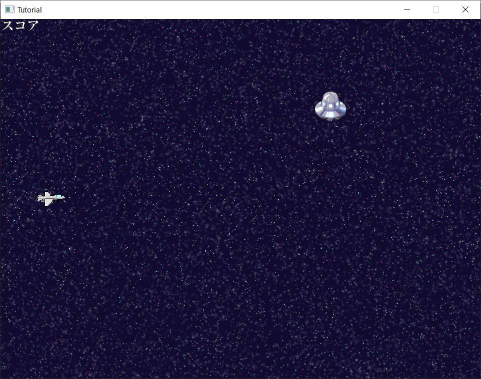

# 8章 : 得点を表示してみよう

前章では音を鳴らすところまで進みました。

今回は5章で設定したスコア(`score`)を、画面に表示してみましょう！

まずは、スコアを表示させるための`TextNode`を作り、それを表示するところまでやってみます。

これが表示できたら、あとは表示するテキストをスコアに切り替えます。

## テキストを表示

まずは、スコア表示用の`TextNode`を追加していきます。

以下のコードを追加してください。

[!code-diff[MainNode](Text/Spl1.cs)]

二つの`TextNode`用の変数を書いたら、

次はこの`TextNode`の設定していきます。

[!code-diff[MainNode](Text/Spl2.cs)]

設定した内容は、
* `TextNode`インスタンスの代入
* フォントの読み込みと設定
* 表示位置を設定
* `uiNode`に追加
の4点です。

この4つの設定をスコアのテキストにしています。

ここで一度実行してみます。

「スコア」が画面上部に表示されているのが確認できました。

ここまできたら次は、実際のスコアを表示してみましょう。

## 実際のスコアを表示

スコアは`score`に格納されていますね。

これらをテキストに設定していきます。

では、以下のコードを追加・削除してください。

[!code-diff[MainNode](Text/Spl3.cs)]

まず、先ほど追加した仮テキストを代入する箇所を削除します。

次に、それぞれのテキスト表示を更新する箇所ですが、

` scoreNode.Text = "Score : " + score; `

このようになっています。

これは、`"Score : "` と `score`変数を合体させて、`"Score : 210"` という形式で表示しようとしています。

この処理を毎フレーム実行することで、現在のスコアを表示することができるようになる、ということです。

では実行してみます

左上の方に「Score」が表示できてますね。

さて、これで現在のスコアを表示できるようになりました。

次回は自機がダメージを受けたときの処理を書いていきます！

## コード全体

最後に、今回修正を加えた、今回の`MainNode`全体を載せておきます。困ったときは見比べたりコピペしてみてください。
[!code-diff[MainNode](Text/Spl4.cs)]