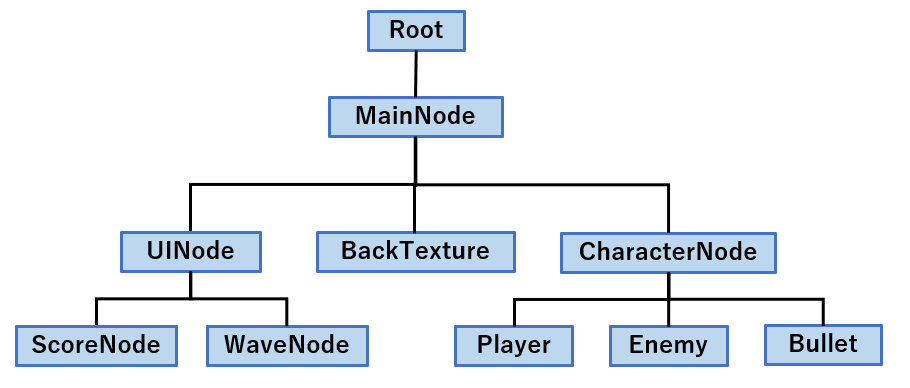

# 9章 : タイトル・ゲームオーバー画面を作ってみよう

ここまでの実装でシューティングとしてほぼほぼ完成形になりました。  
あと一息，タイトル画面や死亡時のゲームオーバー画面を作ればもうゲームとして成立してしまいます。

## タイトル画面の追加

### タイトルノードの実装

まず以下のコードを追加してタイトル画面を作りましょう。

[!code-diff[Main](Spl1.cs)]

基本的に実装は今迄行ってきたような，`SpriteNode`や`TextNode`を用いた画像/文字の描画です。  

ここで注意する点が2つあります。  

1つ目は

```
// エンジンから自身を削除
Engine.RemoveNode(this);

// エンジンにメイン画面を追加
Engine.AddNode(new MainNode());
```

の部分です。
第4章にて，`Program.cs`で`Engine.AddNode(Node)`は書きましたね。
ここでは，**タイトル画面でZキーを押したときメインのシューティング画面に変更する処理**を行っています。

タイトル画面にいるときは，ノードの親子関係はこのようになっています。


此処における`Root`は，`Engine`内で定義されている全てのノードの祖先となるノードです。
`TitleNode`の子ノードとして，タイトルのテキストや案内の文字，背景のテクスチャがあります。
この状態で`Engine.RemoveNode(TitleNode)`を行うとノードの親子関係はこのようになります。


`Root`と`TitleNode`の親子関係が解消され，`TitleNode`に登録されているテキストやテクスチャがウィンドウに描画されなくなります。
`Root.RemoveNode(TitleNode)`とやっていることに違いはありません。

次に`Engine.AddNode(MainNode)`を行う事でノードの親子関係は次のようになります。



`Root`の子に`MainNode`が追加され，`MainNode`での実装が実行されます。
前の章で実装してきたシューティングゲーム本体の内容ですね。

此処で大事なのは，**Engine.Rootの子孫になったノードに描画や更新処理が適用される**という事です。
描画や更新をしたくないノードは`Remove`して，描画や更新を実行したいノードを`Add`するようにしましょう。


2つ目は

```
// 画面が遷移中かどうか
private bool fading = false;
```

の部分です。

この変数は，タイトル画面でZキーを押したときに`true`に変更されます。

```
// 画面が遷移中でなく，Zキーが押された時に実行
if (!fading && Engine.Keyboard.GetKeyState(Keys.Z) == ButtonState.Push)
{
```

そして，`true`になるとこのif文の条件の様に，もう一度Zキーを押してもif文の内容が実行されなくなります。
これは，Zキー連打によって`MainNode`が`Root`に複数追加されるのを防ぎたいという事です。

### タイトルノードへの遷移を追加

タイトルを実装したので，実際にゲームを始めた時に最初に表示されるようにしてみましょう。  
`Program.cs`のコードを次のように書き換えてみましょう。

[!code-diff[Main](Spl2.cs)]

これで最初に表示されるノードが`MainNode`から`TitleNode`に変わりました。