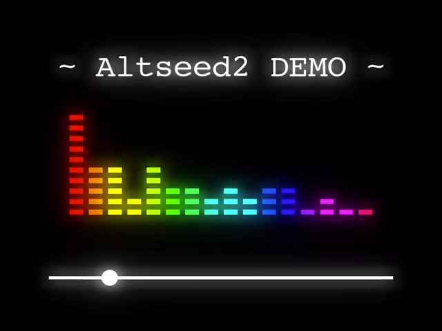
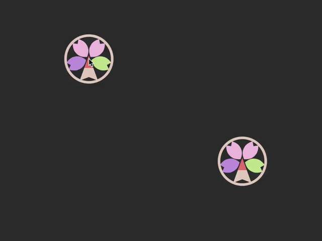

>[!div id="budges"]
>NuGet:
>Engine:
>Core:

## Altseed2とは

Altseed2 はグラフィック、サウンド、ジョイスティックなどの機能をまとめたゲーム用ライブラリです。
オブジェクト指向を用いた開発に適したインタフェースにより、複雑になりがちな機能を少ないコード量で実装することができます。
かつての Altseed と異なり、ノードシステムを採用しており、オブジェクトやオブジェクトが持つ機能の管理を、より柔軟に行うことができます。
その他にも、Altseed2 には初代 Altseed にはなかった機能がいくつか実装されています。

## 使い方

チュートリアルは[こちら](Tutorials/Chap0/index.md)！

## Altseed2 でできること

### 例 : オーディオビジュアライザ
Altseed2 で新たに追加された機能の中に、再生中の音声についてスペクトル解析を行う機能があります。
これを使用することで、音楽に合わせて動くオブジェクトを、簡単に実装することができます。

<video width="320" height="240" autoplay muted="true" loop="true" preload poster="Images/Spectrum.png">
  <source src="Images/Spectrum.mp4" type="video/mp4">
  <source src="Images/Spectrum.webm" type="video/webm">
  
</video>

<!--[!code-csharp[Main](Src/Samples/AudioVisualizerDemonstration/AudioVisualizerDemonstration.cs)]-->

### 例 : 衝突判定
Altseed2 では、オブジェクト同士の衝突判定機能が実装されています。
衝突時の処理を、メソッドとしてクラスの中に記述することができます。

<video width="320" height="240" autoplay muted="true" loop="true" preload poster="Images/Collision.png">
  <source src="Images/Collision.mp4" type="video/mp4">
  <source src="Images/Collision.webm" type="video/webm">
  
</video>

<!--[!code-csharp[Main](Src/Samples/CollisionDemonstration/CollisionDemonstration.cs)]-->

## 必要な環境
Windows : 10 以降 (DirectX11 以上が必要)  
Mac : Mojave 以降  
Linux : 2.1 以降

## リファレンス
- [リファレンス](xref:Altseed2)

## サポート
- [GitHub](https://github.com/altseed/Altseed2)
- [Twitter](https://twitter.com/altseed)
- [Slack](https://altseed.herokuapp.com/)

## Altseed2 For Rust について

現在、Rust で使用できる Altseed2 を鋭意開発中です。